# CV Course Notes

## Date: January 29, 2026

---

## Lecture 1: [Topic Name]

**Slides:** `slides/[filename].pdf` | Pages: 

**Key Concepts:**
- 

**Topic:** 2D Line Representation and Normalization

**Concept Explanation:**
- **Standard Equation:** A general 2D line is given by the equation $ax + by + c = 0$. In homogeneous coordinates, this is represented by the vector $\tilde{l} = (a, b, c)$.
- **Normalization:** To give the coefficients geometric meaning, we normalize the vector so that calculating the magnitude of the normal vector part equals 1.
  - We divide the vector $(a, b, c)$ by $\sqrt{a^2 + b^2}$.
  - The normalized vector is denoted as $l = (\hat{n}_x, \hat{n}_y, d) = (\hat{n}, d)$ where $||\hat{n}|| = 1$.
- **Geometric Interpretation:**
  - $\hat{n} = (\hat{n}_x, \hat{n}_y)$: The **unit normal vector**, which is perpendicular to the line.
  - $d$: The **signed perpendicular distance** from the origin to the line.
- **Exception:** The **line at infinity** $\tilde{l} = (0, 0, 1)$ cannot be normalized this way because the normal vector components $(0,0)$ have a magnitude of 0.

**Questions:**
- 

**Topic:** Figure 2.2 - Geometric Primitives (2D Line & 3D Plane)

**Concept Explanation:**
- **2D Line (Figure 2.2a):** 
  - Represents a line $l$ using the normal $\hat{n}$ and distance $d$. 
  - $d$ is the **perpendicular distance** from the origin to the line. The segment of length $d$ connecting the origin to the line is perpendicular to the line itself.
  - $\hat{n} = (\cos \theta, \sin \theta)$ is the unit normal vector.
  - This corresponds to the **Hough Transform** representation $(\theta, d)$ (where $\theta$ is the angle of the normal).
- **3D Plane (Figure 2.2b):**
  - Represents a plane $m$ in 3D space.
  - Similarly, $d$ is the perpendicular distance from the origin to the plane.
  - $\hat{n}$ is the unit normal vector perpendicular to the plane's surface.
- **Intersections (Homogeneous Coordinates):**
  - **Notation Definition:**
    - $\tilde{x}$: Represents a **Point** in homogeneous coordinates (e.g., $(x, y, 1)$).
    - $\tilde{l}$: Represents a **Line** in homogeneous coordinates (e.g., $(a, b, c)$).
  - **Duality (The "Yeah?": Reference):**
    - **Intersection of two lines $\rightarrow$ Point:** $\tilde{x} = \tilde{l}_1 \times \tilde{l}_2$ (The point $\tilde{x}$ is where lines $\tilde{l}_1$ and $\tilde{l}_2$ meet).
    - **Line joining two points $\rightarrow$ Line:** $\tilde{l} = \tilde{x}_1 \times \tilde{x}_2$ (The line $\tilde{l}$ connects points $\tilde{x}_1$ and $\tilde{x}_2$).

**Topic:** 3D Geometry: Points, Lines, and Planes

**Concept Explanation:**
- **3D Points:**
  - **Inhomogeneous:** $x = (x, y, z) \in \mathcal{R}^3$.
  - **Homogeneous:** $\tilde{x} = (\tilde{x}, \tilde{y}, \tilde{z}, \tilde{w}) \in \mathcal{P}^3$.
  - **Augmented Vector:** Commonly used notation $\bar{x} = (x, y, z, 1)$ (where $\tilde{w}=1$).

- **3D Lines (Figure 2.3 - Parametric Equation):**
  - **Visual:** The diagram shows a 3D line passing through two points, $p$ and $q$.
  - **Equation:** $r = (1 - \lambda)p + \lambda q$.
  - **Explanation:**
    - This is a **parametric representation**. Any point $r$ on the line is defined by the parameter $\lambda$.
    - It represents a weighted combination of the two points $p$ and $q$.
    - If $\lambda = 0$, you are at $p$. If $\lambda = 1$, you are at $q$.
    - If $0 < \lambda < 1$, the point lies between $p$ and $q$ (line segment).

- **3D Planes:**
  - **Homogeneous:** Represented by vector $\tilde{m} = (a, b, c, d)$.
  - **Equation:** $\bar{x} \cdot \tilde{m} = ax + by + cz + d = 0$.
  - **Geometric Interpretation:**
    - Like 2D lines, this can be normalized to $m = (\hat{n}, d)$ with $||\hat{n}|| = 1$.
    - $\hat{n} = (\hat{n}_x, \hat{n}_y, \hat{n}_z)$: The **unit normal vector** perpendicular to the plane.
    - $d$: The perpendicular distance from the origin to the plane.

- **Notation Clarification (The "Hat" $\hat{}$ Symbol):**
  - **Meaning:** The hat symbol (e.g., $\hat{n}, \hat{d}$) typically indicates a **Unit Vector** (a vector with length/magnitude of 1).
  - **Purpose:** Because it has a standard length of 1, it purely represents **Direction**.
  - **Special Case (Line with point at infinity):**
    - usage: $r = p + \lambda \hat{d}$.
    - Here, $p$ is a starting point.
    - $\hat{d}$ is the **direction vector** of the line.
    - This happens when the second point $q$ in the standard equation is a "point at infinity", effectively acting just as a direction pointer.

**Topic:** Degrees of Freedom (DOF) - Basics & Calculation

**Concept Explanation:**
- **What is it?** DOF is the number of **independent** pieces of information required to fully specify a system or object.
- **How to Calculate:**
  $$ \text{DOF} = \text{Total Parameters} - \text{Number of Constraints} $$
  - **Total Parameters:** The number of values you are using to describe the object.
  - **Constraints:** The number of rules or equations those values must satisfy (reducing the freedom).

**Topic:** Degrees of Freedom (DOF) for 3D Lines

**Concept Explanation:**
- **The Core Question:** How many independent numbers do we need to uniquely define a line in 3D space? (Answer: 4)
- **Calculation Examples:**
  1. **Endpoint Representation ($p, q$):** 
     - **Total Parameters:** 6 (two 3D points: $x_1, y_1, z_1$ and $x_2, y_2, z_2$).
     - **Constraints:** 2 (The points can slide independently along the line without changing the line. Each point sliding removes 1 degree of uniqueness/stability for representing that specific locus of points).
     - **Result:** $6 - 2 = 4$.
     - **Clarification on "Sliding":**
       - It does **NOT** mean x, y, or z are constant. They all change as you slide.
       - **What it means:** To define "Line A", you could pick *any* point $P$ on it and *any* point $Q$ on it.
       - Because you have the freedom to move point $P$ anywhere along the infinite length of the line (1 dimension of movement) and still be talking about "Line A", that is **1 redundant degree of freedom**.
       - Same for point $Q$.
       - Total Redundancy = 2.
       - **Analogy:** Naming a street by picking two houses on it. You could pick House 1 and 2, or House 50 and 99. It's the same street (Line). Your choice of *which* houses (points) is the redundancy.
     - **Constraint Check (User Hypothesis):**
       - *Hypothesis:* "If we use 3 points, do we have 6 DOF?"
       - *Correction:* **No.** The Line itself (the object) always has **4 DOF**.
       - Adding a 3rd point just adds more redundancy.
       - math: 9 Parameters (3 points) - 3 Sliding Constraints - 2 Collinearity Constraints (P3 must lie on the line of P1-P2) = **4 DOF**.
       - You cannot change the "freedom" of the geometric object just by using more markers to describe it.
     - **Constraint Check (User Hypothesis 2):**
       - *Hypothesis:* "What if we only have one point?"
       - *Answer:* **Undefined / Impossible.**
       - A single point has **3 DOF** (x, y, z).
       - A Line requires **4 DOF**.
       - You simply do not have enough information. There are infinite lines passing through a single point (imagine a starburst or pin-cushion).
     - **Constraint Check (User Hypothesis 3 - 2D Case):**
       - *Hypothesis:* "If we are in 2D, do we have 2 DOF?"
       - *Answer:* **YES.**
       - **Method 1: Two-Point Calculation (Consistent with your 3D logic):**
         - **Parameters:** 4 Coords (Point 1 has $x_1, y_1$; Point 2 has $x_2, y_2$).
         - **Constraints:** 2 independent slides (Point 1 slides, Point 2 slides).
         - **Result:** $4 - 2 = 2$ DOF.
       - **Method 2: Equation Calculation:**
         - **Parameters:** 3 (Equation $ax + by + c = 0$).
         - **Constraints:** 1 (Scale independence).
         - Result: $3 - 1 = 2$ DOF.
       - *Both methods give the same answer!*
  2. **Plücker Coordinates:**
     - **Total Parameters:** 6 (elements in matrix).
     - **Constraints:** 2 (Homogeneous scale $-1$, Determinant $|L|=0$ constraint $-1$).
     - **Result:** $6 - 2 = 4$.
  - **Two-Plane Parametrization (Visualizing the 4 numbers):** Imagine two parallel planes (e.g., $z=0$ and $z=1$). A line will puncture these planes at two points: $(x_1, y_1)$ on the first plane and $(x_2, y_2)$ on the second. These **4 coordinates** uniquely define the line.
    - Used in **Light Field** and **Lumigraph** rendering.

**Topic:** Page Content Summary (Advanced Representations)

**Concept Explanation:**
- **Plücker Coordinates (Matrix $L$):**
  - Used to represent lines without bias (the two-plane method fails if the line is parallel to the planes).
  - Uses a $4 \times 4$ skew-symmetric matrix $L = \tilde{p}\tilde{q}^T - \tilde{q}\tilde{p}^T$.
  - Defined by 6 values, but homogeneous scaling (-1 DOF) and a determinant constraint $|L|=0$ (-1 DOF) bring it back to **4 DOF**.
- **3D Quadrics:**
  - The 3D version of conics (circles, ellipses).
  - Equation: $\tilde{x}^T Q \tilde{x} = 0$ (defines surfaces like spheres, ellipsoids, cylinders).
  - Useful for modeling simple 3D primitives.

**Topic:** Cross Product & Skew-Symmetric Matrix

**Concept Explanation:**
- **Standard Definition:** The cross product $a \times b$ gives a vector perpendicular to both $a$ and $b$.
  - Typically calculated using the determinant of a matrix with basis vectors $i, j, k$.
  - **What are i, j, k?**
    - They represent the **Standard Basis Vectors** (the directions of the axes).
    - $\mathbf{i} = (1, 0, 0)$ corresponds to the x-axis.
    - $\mathbf{j} = (0, 1, 0)$ corresponds to the y-axis.
    - $\mathbf{k} = (0, 0, 1)$ corresponds to the z-axis.
    - They are placed in the top row of the determinant as "placeholders" so that when you calculate the determinant, the result ends up being a vector $(Result_x, Result_y, Result_z)$.
- **Matrix Representation (The "CV Way"):**
  - In Computer Vision, we often want to write the cross product as a linear algebra operation (Matrix $\times$ Vector).
  - We convert vector **$a$** into a special **Skew-Symmetric Matrix**, denoted as $[a]_\times$.
  - Formula: $a \times b = [a]_\times b$
- **The Skew-Symmetric Matrix $[a]_\times$:**
  $$ [a]_\times = \begin{bmatrix} 0 & -a_3 & a_2 \\ a_3 & 0 & -a_1 \\ -a_2 & a_1 & 0 \end{bmatrix} $$
- **Why do this?**
  - It allows us to treat "crossing with $a$" as just "multiplying by a matrix".
  - Extremely useful for writing equations like Epipolar constraints ($x'^T E x = 0$) later in the course.
- **Derivation: Why are they the same?**
  - **1. Expand the Determinant (Top equation):**
    $$ a \times b = \det \begin{vmatrix} i & j & k \\ a_1 & a_2 & a_3 \\ b_1 & b_2 & b_3 \end{vmatrix} $$
    - $i(a_2 b_3 - a_3 b_2)$
    - $-j(a_1 b_3 - a_3 b_1) = j(a_3 b_1 - a_1 b_3)$
    - $+k(a_1 b_2 - a_2 b_1)$
    - **Result Vector:** $(a_2 b_3 - a_3 b_2, \quad a_3 b_1 - a_1 b_3, \quad a_1 b_2 - a_2 b_1)$
  - **2. Multiply the Matrix (Bottom equation):**
    $$ [a]_\times b = \begin{bmatrix} 0 & -a_3 & a_2 \\ a_3 & 0 & -a_1 \\ -a_2 & a_1 & 0 \end{bmatrix} \begin{pmatrix} b_1 \\ b_2 \\ b_3 \end{pmatrix} $$
    - Row 1: $0(b_1) - a_3(b_2) + a_2(b_3) = \mathbf{a_2 b_3 - a_3 b_2}$
    - Row 2: $a_3(b_1) + 0(b_2) - a_1(b_3) = \mathbf{a_3 b_1 - a_1 b_3}$
    - Row 3: $-a_2(b_1) + a_1(b_2) + 0(b_3) = \mathbf{a_1 b_2 - a_2 b_1}$
  - **Conclusion:** The results are identical. The matrix is just "factored out" coefficients from the determinant result.

- **Deep Dive: How did they build that matrix? (The Missing Step)**
  - **Goal:** We want to separate vector $b$ from the equation so it looks like $[Matrix] \cdot b$.
  - **Method:** Look at the Result Vector and "factor out" $b_1, b_2, b_3$.
  - **Row 1:** $a_2 b_3 - a_3 b_2$
    - Rewrite as: $(0)b_1 + (-a_3)b_2 + (a_2)b_3$
    - Coefficients become Row 1 of matrix: $[0, \quad -a_3, \quad a_2]$
  - **Row 2:** $a_3 b_1 - a_1 b_3$
    - Rewrite as: $(a_3)b_1 + (0)b_2 + (-a_1)b_3$
    - Coefficients become Row 2 of matrix: $[a_3, \quad 0, \quad -a_1]$
  - **Row 3:** $a_1 b_2 - a_2 b_1$
    - Rewrite as: $(-a_2)b_1 + (a_1)b_2 + (0)b_3$
    - Coefficients become Row 3 of matrix: $[-a_2, \quad a_1, \quad 0]$

    

**Topic:** Example: 2D Line Intersection

**Concept Explanation:**
- **Goal:** Find where the line $y=1$ and $x=2$ intersect using Homogeneous Geometry.
- **Step 1: Define the Lines ($\tilde{l}$):**
  - **Line 1 ($y = 1$):**
    - Equation: $0x + 1y - 1 = 0$
    - Vector: $\tilde{l}_1 = (0, 1, -1)^T$
  - **Line 2 ($x = 2$):**
    - Equation: $1x + 0y - 2 = 0$
    - Vector: $\tilde{l}_2 = (1, 0, -2)^T$
- **Step 2: Calculate Intersection ($\tilde{x} = \tilde{l}_1 \times \tilde{l}_2$):**
  - Using Matrix Method: $\tilde{x} = [\tilde{l}_1]_\times \tilde{l}_2$
  - Matrix $[l_1]_\times = \begin{bmatrix} 0 & -(-1) & 1 \\ -1 & 0 & -(0) \\ -1 & 0 & 0 \end{bmatrix} = \begin{bmatrix} 0 & 1 & 1 \\ -1 & 0 & 0 \\ -1 & 0 & 0 \end{bmatrix}$
  - Calculation:
    $$ \begin{bmatrix} 0 & 1 & 1 \\ -1 & 0 & 0 \\ -1 & 0 & 0 \end{bmatrix} \begin{pmatrix} 1 \\ 0 \\ -2 \end{pmatrix} = \begin{pmatrix} -2 \\ -1 \\ -1 \end{pmatrix} $$
  - Result Vector: $\tilde{x} = (-2, -1, -1)^T$
- **Step 3: Convert to Cartesian Point:**
  - $\tilde{x} = (-2, -1, -1)$
  - Divide by $w$ ($w = -1$):
  - $x = -2 / -1 = 2$
  - $y = -1 / -1 = 1$
  - **Final Point:** $(2, 1)$, which matches the graph!

- **Concept Check: Why are the $z$ values -1 and -2?**
  - **Question:** Looking at the graph, we see $y=1$ and $x=2$. Why do the vectors have $-1$ and $-2$?
  - **Answer:** It comes from the **Standard Form** Requirement: $ax + by + c = 0$.
  - **For Line 1:**
    - Start: $y = 1$
    - Move to match form ($=0$): $0x + 1y - 1 = 0$
    - Extract Coefficients: $(0, 1, \mathbf{-1})$
  - **For Line 2:**
    - Start: $x = 2$
    - Move to match form ($=0$): $1x + 0y - 2 = 0$
    - Extract Coefficients: $(1, 0, \mathbf{-2})$
  - **Rule of Thumb:** If the line equation equals a positive constant, that constant becomes negative when put into the vector.
  - **Intuition (The "Cancel Out" Effect):**
    - Recall the dot product rule: $\tilde{x} \cdot \tilde{l} = 0$.
    - If you have a point at $x=2$ (component is $+2$), you necessarily need a $-2$ in the line vector to "cancel it out" and reach zero.
    - $1(2) + ... + (-2)(1) = 0$.
    - Values must oppose each other to sum to zero.

    ---

**Topic:** Example 2: Parallel Lines Intersection (Points at Infinity)

**Concept Explanation:**
- **Goal:** Find intersection of two **parallel** lines: $x=1$ and $x=2$.
- **Step 1: Vectors:**
  - $x=1 \rightarrow 1x + 0y - 1 = 0 \rightarrow \tilde{l}_1 = (1, 0, -1)^T$.
  - $x=2 \rightarrow 1x + 0y - 2 = 0 \rightarrow \tilde{l}_2 = (1, 0, -2)^T$.
- **Step 2: Intersection ($\tilde{x} = \tilde{l}_1 \times \tilde{l}_2$):**
  - $\tilde{x} = \begin{bmatrix} 0 & -(-1) & 0 \\ -1 & 0 & -1 \\ -0 & 1 & 0 \end{bmatrix} \begin{pmatrix} 1 \\ 0 \\ -2 \end{pmatrix}$
  - *Correction on Cross Product Math:*
    - $i(0(-2) - 0(0)) = 0$
    - $-j(-2 - (-1)) = -j(-1) = 1$
    - $k(0 - 0) = 0$
  - **Result:** $\tilde{x} = (0, 1, 0)^T$.
- **Step 3: Interpretation:**
  - $\tilde{x} = (0, 1, 0)$.
  - **Coordinate $w = 0$:** This means it is a **Point at Infinity** (Ideal Point).
  - **Direction:** The point lies in the direction $(0, 1)$, which is the **vertical axis (y-axis)**.
  - **Conclusion:** Two vertical parallel lines meet at the "vertical infinity".
- **Check with Line at Infinity ($\tilde{l}_\infty$):**
  - The Line at Infinity is $\tilde{l}_\infty = (0, 0, 1)^T$.
  - Does our point lie on it?
  - $\tilde{l}_\infty^T \tilde{x} = (0, 0, 1) \cdot (0, 1, 0) = 0$.
  - **Yes.** All parallel intersections lie on the Line at Infinity.

  - **Yes.** All parallel intersections lie on the Line at Infinity.

**Topic:** 2D Translation & Transformation Hierarchy

**Concept Explanation:**
- **The Hierarchy:** The slide shows how shapes can be distorted in increasingly complex ways:
  1.  **Translation:** Just moving the shape (Shift).
  2.  **Euclidean:** Moving + Rotating (Rigid body).
  3.  **Similarity:** Moving + Rotating + Scaling (Shape stays same, size changes).
  4.  **Affine:** Parallel lines stay parallel (Shear / Squash).
  5.  **Projective:** Parallel lines converge (Perspective).

- **Focus: 2D Translation:**
  - **DOF:** 2 Degrees of Freedom ($t_x, t_y$).
  - **Standard Math:** $x' = x + t$ (Addition).
  - **Homogeneous Math (The Power Move):**
    - By adding that extra '1' to make it a vector $(x, y, 1)$, we can turn "addition" into "multiplication".
    - Matrix Equation:
      $$ \begin{pmatrix} x' \\ y' \\ 1 \end{pmatrix} = \begin{bmatrix} 1 & 0 & t_x \\ 0 & 1 & t_y \\ 0 & 0 & 1 \end{bmatrix} \begin{pmatrix} x \\ y \\ 1 \end{pmatrix} $$
    - **Check:**
      - Row 1: $1(x) + 0(y) + t_x(1) = x + t_x$ (Correct!)
      - Row 2: $0(x) + 1(y) + t_y(1) = y + t_y$ (Correct!)
      - Row 2: $0(x) + 1(y) + t_y(1) = y + t_y$ (Correct!)
  - **Clarification on $\mathbf{t}$:**
    - Yes, $\mathbf{t} = (t_x, t_y)$ represents the **linear shift** or distance moved.
    - $t_x$: How much you move to the right (positive) or left (negative).
    - $t_y$: How much you move up (positive) or down (negative).
    - It is literally just the "Offset" added to the original position.
  - **Why?** This block structure $\begin{bmatrix} I & t \\ 0^T & 1 \end{bmatrix}$ allows us to **chain** multiple transformations (rotation, scale, translation) by just multiplying matrices together.

**Topic:** Affine Transformations

**Concept Explanation:**
- **Definition:** A linear transformation (Rotation, Scale, Shear) followed by a Translation.
- **Degrees of Freedom (DOF):** 6 DOF.
  - **4 Linear Params:** The $2 \times 2$ matrix $A$ has 4 independent values ($a, b, c, d$). These handle rotation, scaling, and shearing.
  - **2 Translation Params:** The vector $t$ has 2 independent values ($t_x, t_y$).
  - Total: $4 + 2 = 6$.
- **Matrix Form:**
  $$ H_{affine} = \begin{bmatrix} A & t \\ 0^T & 1 \end{bmatrix} $$
  - where $A$ is an arbitrary $2 \times 2$ matrix.
- **Key Property:** **Parallel Lines remain Parallel.**
  - This is the "golden rule" of Affine transformations.
  - You can squash a square into a parallelogram (shear), but the top and bottom sides will still be parallel to each other.
  - It does **not** preserve angles (rectangles can become sloped) or lengths, but it preserves "parallelism".

  - See diagram below:
    - **Green:** Original Square.
    - **Blue:** Translation (Shift).
    - **Red:** Affine (Shear/Squash). Note top/bottom still parallel.

- **Deep Dive: Counting the 6 Numbers (Where do they come from?)**
  - Look at the matrix structure:
    $$ \begin{bmatrix} \mathbf{a} & \mathbf{b} & \mathbf{t_x} \\ \mathbf{c} & \mathbf{d} & \mathbf{t_y} \\ 0 & 0 & 1 \end{bmatrix} $$
  - **Count them:**
    - $\mathbf{a, b, c, d}$: These 4 numbers in the top-left corner can be anything. (They control rotation, scale, shear).
    - $\mathbf{t_x, t_y}$: These 2 numbers in the right column can be anything. (They control position/translation).
    - The bottom row $(0, 0, 1)$ is **FIXED**. You cannot change it (or it stops being Affine).
  - **Total:** $4 + 2 = \mathbf{6}$ Degrees of Freedom.

**Topic:** Projective Transformations (Homography)

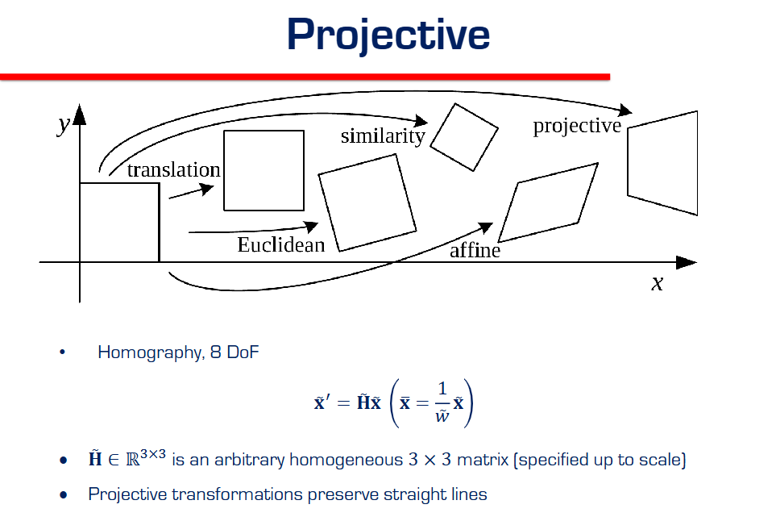

**Concept Explanation:**
- **Definition:** The general form of linearity in Projective Space. Also called a **Homography**.
- **Degrees of Freedom (DOF):** 8 DOF.
  - Matrix $\tilde{H}$ is $3 \times 3$, so it has **9 numbers**.
  - **Constraint:** It is defined "up to scale" (Homogeneous).
  - Multiplying the whole matrix by a constant $k$ doesn't change the transformation.
  - So we lose 1 DOF.
  - **Total:** $9 - 1 = \mathbf{8}$.
- **Matrix Form:**
  $$ \tilde{x}' = \tilde{H} \tilde{x} $$
  - $\tilde{H}$ is an **arbitrary** $3 \times 3$ matrix (rank 3).
  - No zeros required (unlike Affine).
- **Key Property:** **Preserves Straight Lines.**
  - Parallel lines do **NOT** remain parallel (they converge to a vanishing point).
  - But straight lines always remain straight (they don't curve).
  - This is the transformation that models **perspective cameras**.

- **Deep Dive: Who has the Degrees of Freedom? (Matrix vs Coordinates)**
  - **Your Question:** "The coordinates didn't really have a say, so what are they?"
  - **The Answer:** DOF describes the **Machine**, not the Material.
    - **The Matrix H (The Machine):** This is the object that *does* the transforming. It has 8 "knobs" (DOF) we can twist to stretch/squash the image.
    - **The Coordinates x (The Material):** These are just the points we feed into the machine. They don't have parameters; they are just data.

- **Clarification: "Do the others preserve straight lines too?"**
  - **Yes!** All the transformations below it (Affine, Similarity, Euclidean, Translation) also preserve straight lines.
  - **The Difference:**
    - **Affine** preserves Straight Lines AND Parallel Lines.
    - **Projective** preserves Straight Lines BUT destroys Parallel Lines (they intersect at infinity).
  - It is the *most general* transform that still keeps lines straight. If you go further (e.g., lens distortion), straight lines become curves!

- **Recovering Real (Euclidean) Coordinates:**

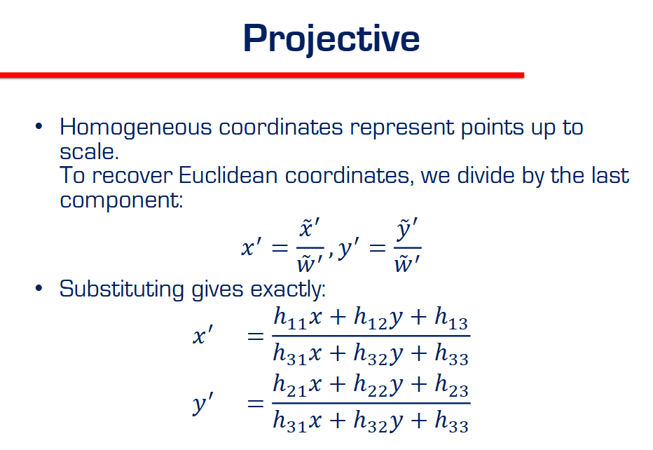
  - **The Problem:** The result of $\tilde{x}' = H \tilde{x}$ gives use a homogeneous vector $(\tilde{x}', \tilde{y}', \tilde{w}')$.
  - **The Fix:** To get the actual pixel coordinates $(x', y')$ on the screen, we must **divide by the last component** $\tilde{w}'$.
  - **Formulas:**
    $$ x' = \frac{\tilde{x}'}{\tilde{w}'}, \quad y' = \frac{\tilde{y}'}{\tilde{w}'} $$
  - **Expanded Form (The Rational Function):**
    - If $H = \begin{bmatrix} h_{11} & h_{12} & h_{13} \\ h_{21} & h_{22} & h_{23} \\ h_{31} & h_{32} & h_{33} \end{bmatrix}$, then:
    $$ x' = \frac{h_{11}x + h_{12}y + h_{13}}{h_{31}x + h_{32}y + h_{33}} $$
    $$ y' = \frac{h_{21}x + h_{22}y + h_{23}}{h_{31}x + h_{32}y + h_{33}} $$
  - **Note:** The denominator is the same for both! It comes from the 3rd row (the projection row).

---

**Topic:** 3D Transformations Summary

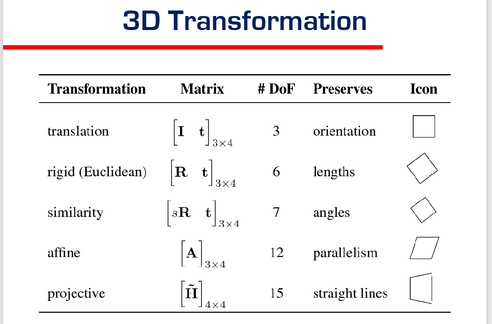

**Concept Explanation:**
- **Overview:** We can extend the 2D hierarchy to 3D space. The matrices become $4 \times 4$ (Homogeneous 3D).
- **Summary Table:**

| Transformation | Matrix | DOF | Preserves | Details |
| :--- | :--- | :--- | :--- | :--- |
| **Translation** | $[I \quad t]_{3 \times 4}$ | **3** | Orientation | Just moving ($t_x, t_y, t_z$). No rotation. |
| **Rigid (Euclidean)** | $[R \quad t]_{3 \times 4}$ | **6** | Lengths | Rotation (3 DOF) + Translation (3 DOF). |
| **Similarity** | $[sR \quad t]_{3 \times 4}$ | **7** | Angles | Rigid (6) + Unit Scale (1). shape stays same. |
| **Affine** | $[A]_{3 \times 4}$ | **12** | Parallelism | Linear (9) + Translation (3). Parallel planes/lines stay parallel. |
| **Projective** | $[\tilde{H}]_{4 \times 4}$ | **15** | Straight Lines | $4 \times 4$ Matrix (16) - Scale (1, homogeneous). |

- **Key DOF Counts (3D):**
  - **Rigid:** 6 (3 Rotate + 3 Move). Compare to 2D Rigid which is 3 (1 Rotate + 2 Move).
  - **Affine:** 12. ($3 \times 3$ matrix $A$ has 9, Vector $t$ has 3. $9+3=12$).
  - **Projective:** 15. ($4 \times 4$ has 16 numbers. Minus 1 for homogeneous scale = 15).

  - **Projective:** 15. ($4 \times 4$ has 16 numbers. Minus 1 for homogeneous scale = 15).

**Topic: Geometric Image Formation (The Pinhole Camera)**

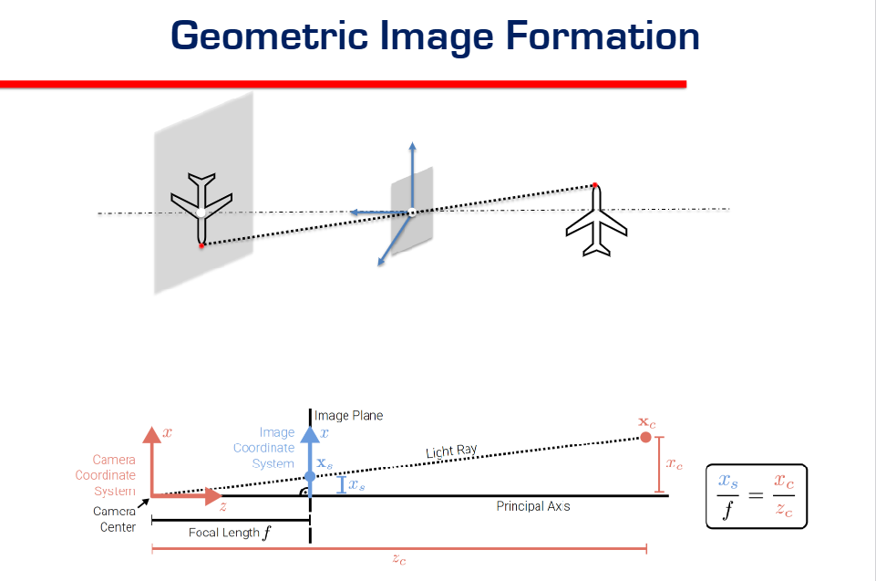

**Concept Explanation:**
- **The Setup:**
  - **Camera Center:** The pinhole (the origin of the coordinate system).
  - **Image Plane:** Where the image lands (film/sensor). Located at distance $f$ (focal length) from the center.
  - **Object:** A real world point at coordinates $(X_c, Y_c, Z_c)$.
- **The Math: Similar Triangles:**
  - Look at the side view (the diagram).
  - We have a big triangle (from Camera Center to Object) and a small triangle (from Camera Center to Image Plane).
  - **Ratio of Heights = Ratio of Distances.**
  - Let $x_s$ be the screen coordinate (height on image).
  - Let $x_c$ be the real world x-coordinate (height of object).
  - Let $z_c$ be the real world depth (distance to object).
  - Let $f$ be the focal length (distance to image).
- **The Equation:**
  $$ \frac{x_s}{f} = \frac{x_c}{z_c} $$
- **Result (Projection Formula):**
  $$ x_s = f \cdot \frac{x_c}{z_c} $$
  - **Meaning:** The harder (further) the object is ($z_c$ increases), the smaller it appears ($x_s$ decreases). This is **perspective**.

- **Common Confusion: Where is everything?**
  - **The Object ($x_c$):** This is the physical thing (e.g., the airplane) out in the world. It emits light.
  - **The Pinhole (Origin $0,0,0$):** This is the "Apperture" or distinct hole. All light rays MUST pass through this single point.
  - **The Image Plane ($x_s$):** This is the screen/sensor where the light hits.
    - **Physical Reality:** In a real camera, the film is **BEHIND** the pinhole. This creates an **upside-down** image (inverted).
    - **Math Trick (Virtual Plane):** To make the math easier (and avoid negative signs), we often draw the Image Plane **IN FRONT** of the pinhole (as seen in the diagram).
    - This creates an **upright** image. It is mathematically equivalent but easier to think about.

- **The Two Coordinate Systems:**
  - **1. Camera Coordinate System ($x_c, y_c, z_c$):**
    - **Type:** 3D Dimensions.
    - **Origin:** The Pinhole itself.
    - **Role:** Describes where objects are in the 3D world relative to the camera.
    - **Units:** Meters or Millimeters.
  - **2. Image Coordinate System ($x, y$):**
    - **Type:** 2D Dimensions.
    - **Origin:** The center of the image frame (principal point).
    - **Role:** Describes where the "dot" lands on the picture/sensor.
    - **Units:** Pixels (usually).
  - **The Goal of Computer Vision:** To convert a point from System 1 (3D World) to System 2 (2D Image).

- **Analogy: The Image Plane is the Sensor**
  - **Is it the final image?** **YES.**
  - think of the **Image Plane** as the actual **CMOS Sensor** chip inside a phone camera.
  - **Coordinate $x, y$:** This is the physical location on that chip (e.g., 3mm from the left edge).
  - **Resolution:**
    - The Image Plane is continuous math (real numbers).
    - To get **Resolution** (e.g., $1920 \times 1080$), we chop that plane up into a grid of tiny buckets called **Pixels**.
    - So, "Image Coordinates" directly map to "which pixel lit up."

- **Connection to High School Physics:**
  - **Your Memory:** $\frac{IH}{OH} = \frac{ID}{OD}$
  - **Translation to CV:** It is the **Exact Same Formula**.
    - **IH (Image Height):** $\rightarrow x_s$ (Coordinate on screen)
    - **OH (Object Height):** $\rightarrow x_c$ (Coordinate in world)
    - **ID (Image Distance):** $\rightarrow f$ (Focal Length)
    - **OD (Object Distance):** $\rightarrow z_c$ (Depth)
  - **Equation:**
    $$ \frac{x_s}{x_c} = \frac{f}{z_c} \implies x_s = f \frac{x_c}{z_c} $$
  - **Key Takeaway:** Computer Vision is just "High School Optics" done with Matrices. The core rule is: **Divide by Depth ($z$).**

- **Topic: 2D Points (The Visual Intuition)**
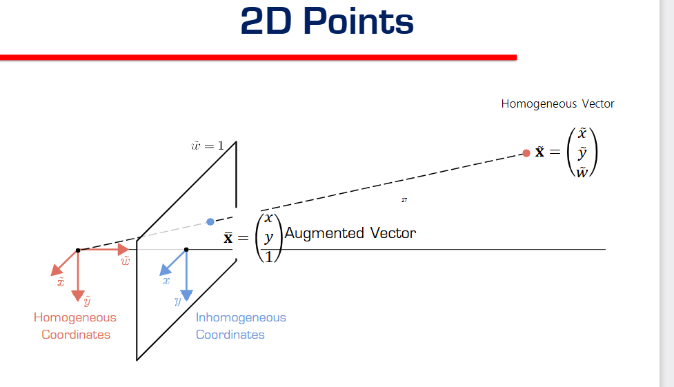
  - **The Diagram Explained:**
    - The image shows a 3D coordinate system origin with a plane floating at distance $w=1$.
    - It distinguishes three specific ways to describe a point:

  - **1. Homogeneous Coordinates $\tilde{\mathbf{x}} = (\tilde{x}, \tilde{y}, \tilde{w})$**
    - **Visual:** The **Red/Orange Dot** (and the dashed ray leading to it).
    - **Definition:** This is a point *anywhere* in space.
    - **Key Feature:** It defines the direction of the ray. It has an arbitrary scale $w$.

  - **2. Augmented Vector $\bar{\mathbf{x}} = (x, y, 1)$**
    - **Visual:** The **Intersection Point** on the plane (where the ray crosses $w=1$).
    - **Definition:** This is the *Standardized* version. We force the last coordinate to be 1.
    - **How to get it:** $\bar{x} = \tilde{x} / \tilde{w}$.
    - **Purpose:** It locks the scale so we can measure it.

  - **3. Inhomogeneous Coordinates $(x, y)$**
    - **Visual:** The **2D Arrows** (Blue) drawn flat on the plane.
    - **Definition:** The standard 2D coordinates derived from the Augmented Vector.
    - **Relation:** Just drop the '1' from the Augmented Vector.

  - **Summary:**
    - **Homogeneous:** Arbitrary 3D Point (The Source Data).
    - **Augmented:** Normalized 3D Point (The Scaling Step).
    - **Inhomogeneous:** Final 2D Point (The Image Result).

**Grad Student Takeaway: The Intuition (Why do we do this?)**
1.  **Ambiguity (The Ray):**
    *   This diagram proves that **Vision is Ambiguous**.
    *   Infinite 3D points (along the ray) map to the *same* 2D pixel.
    *   This is the start of the "Inverse Problem" (you can't easily go back from 2D to 3D because you don't know *where* on the ray the point was).
2.  **Linearization (The "Why"):**
    *   Why add a fake dimension ($w$)?
    *   To make the math linear.
    *   Division ($x/z$) is non-linear and hard. Matrix multiplication is linear and easy.
    *   We trade **1 extra dimension** for **Linear Math**.
3.  **Projective Equivalence:**
    *   Vectors that differ only by scale are considered "equal".
    *   Vectors that differ only by scale are considered "equal".
    *   $\mathbf{x} \equiv k \mathbf{x}$.

- **Topic: Perspective Projection (The Matrix Form)**

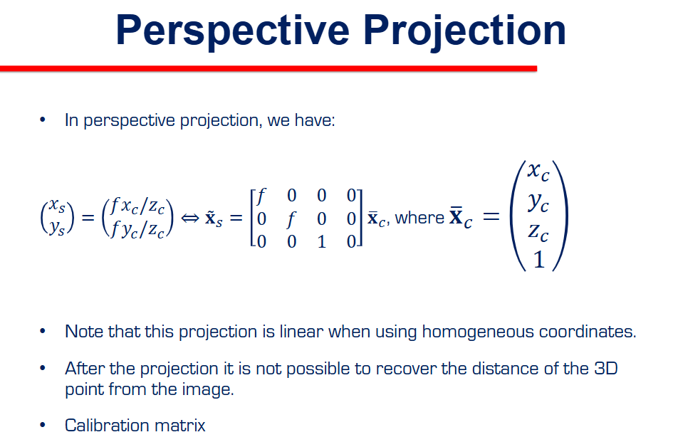
  - **The Goal:** Turn the division formula $x = f \frac{X}{Z}$ into a clean Matrix Multiplication (Linear).
  - **The Matrix ($3 \times 4$):**
    $$ M = \begin{bmatrix} f & 0 & 0 & 0 \\ 0 & f & 0 & 0 \\ 0 & 0 & 1 & 0 \end{bmatrix} $$
  - **The Input:** A 3D Point $(x_c, y_c, z_c, 1)$.
  - **The Multiplication Check:**
    $$ \begin{bmatrix} f & 0 & 0 & 0 \\ 0 & f & 0 & 0 \\ 0 & 0 & 1 & 0 \end{bmatrix} \begin{pmatrix} x_c \\ y_c \\ z_c \\ 1 \end{pmatrix} = \begin{pmatrix} f x_c \\ f y_c \\ z_c \end{pmatrix} $$
  - **The Output Vector:** $\tilde{x}_s = (fx_c, fy_c, z_c)$.
  - **The Recovery (Divide by last element $z_c$):**
    - x coordinate: $\frac{f x_c}{z_c}$ (Matches!)
    - y coordinate: $\frac{f y_c}{z_c}$ (Matches!)
    - w coordinate: $\frac{z_c}{z_c} = 1$
  - **Conclusion:** This matrix successfully performs perspective projection.
  - **Note:** It drops the original depth information. You can't stick a reverse gear on this matrix to get back the distance $z$ (because of that projection to 2D).

- **FAQ: Why is this matrix $3 \times 4$ when the previous one was $3 \times 3$?**
  - **Your Observation:** "Is it the same? I see an extra column of 0s added for the dimension of the homogeneous coordinates."
  - **The Answer:** You are spot on.
    - **Previous (Homography):** We were mapping **2D Plane $\rightarrow$ 2D Plane**.
      - Input: $(x, y, 1)$ [3 components].
      - Matrix: **$3 \times 3$** (to match input size 3).
    - **Current (Projection):** We are mapping **3D World $\rightarrow$ 2D Image**.
      - Input: $(x, y, z, 1)$ [4 components].
      - Matrix: Must be **$3 \times 4$** to "eat" the 4-component vector and spit out a 3-component vector (Image coordinate).
  - **The "Extra Column":** The 4th column specifically handles the translation/offset of the 4th input coordinate ($w=1$). In this simple case, it is all zeros because the camera is at the origin.

- **Deep Dive: Anatomy of the Matrix (Where did 'f' and 'z' come from?)**
  - **Question:** "Trying to understand the $2 \times 2$ 'f' block... and where did 'z' come from?"
  - **The Breakdown:**
    $$ \begin{bmatrix} \mathbf{f} & 0 & 0 & 0 \\ 0 & \mathbf{f} & 0 & 0 \\ 0 & 0 & \mathbf{1} & 0 \end{bmatrix} $$
  - **Row 1 & 2 (The Numerators):**
    - The diagonal $\mathbf{f}$ multiplies with $x$ and $y$.
    - Result: $\mathbf{f}x$ and $\mathbf{f}y$.
    - This creates the top part of our formula: $x_{screen} \approx f \cdot x_{world}$.
  - **Row 3 (The Denominator Stasher):**
    - This is the clever part. We put a $\mathbf{1}$ in the 3rd slot (the z-slot).
    - It multiplies with $z_{world}$.
    - Result: $\mathbf{1} \cdot z = z$.
    - **Why?** It "stashes" the depth value $z$ into the 3rd component of the result vector $(\dots, \dots, z)$.
    - Later, when we convert back to Euclidean (Divide by Last Component), we effectively **Divide by Z**.
    - Later, when we convert back to Euclidean (Divide by Last Component), we effectively **Divide by Z**.
    - That's how we trick linear matrices into doing division!

- **Topic: Principal Point Offset (The Coordinate Shift)**
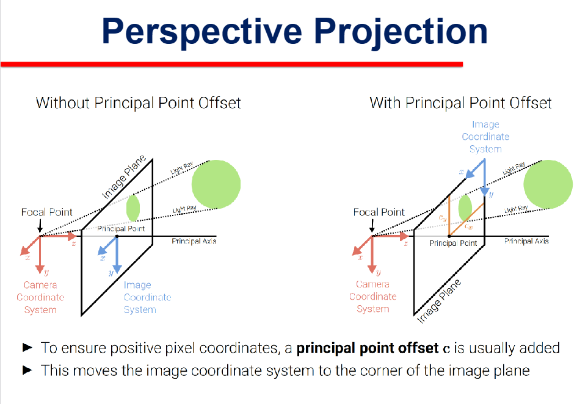
  - **The Problem:** 
    - In Math (Left Image), the origin $(0,0)$ is in the **Center** of the image plane (where the optical axis hits).
    - This means pixels to the left/bottom are **Negative**.
    - Digital images (Right Image) store pixels starting from the **Top-Left Corner** $(0,0)$. They can only be positive integers.
  - **The Solution:** Add an Offset $(c_x, c_y)$.
    - We "shift" the origin from the center to the corner.
    - **Formula Update:**
      $$ x_s = f \frac{x_c}{z_c} + c_x $$
      $$ y_s = f \frac{y_c}{z_c} + c_y $$
      $$ y_s = f \frac{y_c}{z_c} + c_y $$
  - **Result:** All your pixel coordinates become positive numbers (e.g., $0$ to $1920$).

- **Topic: The Full Model (Camera Intrinsics $K$)**
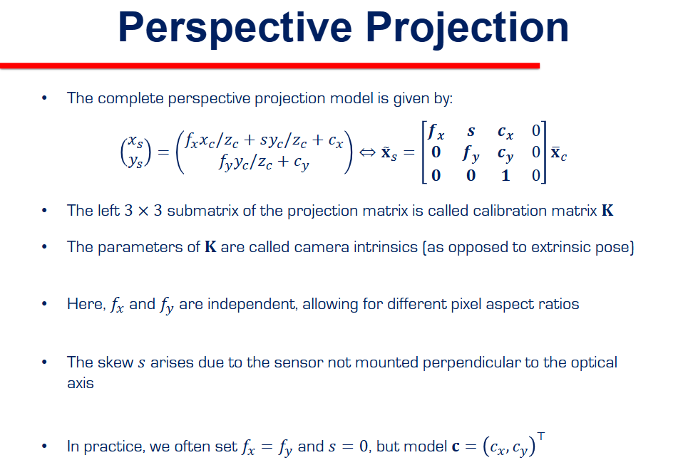
  - **The Matrix K (Calibration Matrix):** This $3 \times 3$ matrix contains all the parameters internal to the camera.
    $$ K = \begin{bmatrix} f_x & s & c_x \\ 0 & f_y & c_y \\ 0 & 0 & 1 \end{bmatrix} $$
  - **Vocabulary:** These parameters are called **Camera Intrinsics** (properties of the device itself), as opposed to "Extrinsics" (where the camera is in the room).
  - **Parameter Breakdown:**
    - **$f_x, f_y$ (Focal Lengths):** Note there are two.
      - *Reason:* Old cameras had non-square pixels, so x and y scaling were different.
      - *Modern Practice:* Square pixels mean $f_x = f_y$.
    - **$c_x, c_y$ (Principal Point / Offset):** The center-to-corner shift we just learned.
    - **$s$ (Skew):** Measures if the sensor is mounted crooked (not 90 degrees to lens).
      - *Modern Practice:* Usually $s = 0$ (manufacturing is good now).
    - **Valid Simplification:**
      $$ K \approx \begin{bmatrix} f & 0 & W/2 \\ 0 & f & H/2 \\ 0 & 0 & 1 \end{bmatrix} $$

- **Deep Dive: What do these specific letters mean?**
  - **1. The Input ($x_c, y_c, z_c$):**
    - These are the **Camera Coordinates**.
    - Imagine you are holding the camera.
    - $x_c$: How far **Right** the object is (in meters).
    - $y_c$: How far **Down** the object is (in meters).
    - $z_c$: How far **Away** (Depth) the object is (in meters).
  
  - **2. The Skew ($s$):**
    - This measures if your pixels are **Rectangles** or **Parallelograms**.
    - If the sensor grid is tilted (bent), $s$ is not zero.
    - **In reality:** Chips are made of silicon crystals. They are perfect rectangles. **$s$ is always 0** for modern cameras. Ignore it.

  - **3. The Offset ($c_x, c_y$) - Honest Explanation:**
    - Think of a graph paper.
    - **Center Origin:** Math likes $(0,0)$ in the middle.
      - A point at the top-left is $(-960, -540)$.
    - **Corner Origin:** Computer screens start counting at pixel 0 from the top-left.
      - A point at the top-left must be $(0, 0)$.
    - **How do you turn -960 into 0?** You add +960.
    - **That is all $c_x$ is.** It is the number you add to force the math to match the screen.
    - **Student Summary:** "So we just have to ensure cx i.e top left of the screen to match zero zero by adding the appropriate offset?"
      - **YES.** That is the entire purpose of $c_x$ and $c_y$.
      - **Note:** You handle both at once. $c_x$ fixes the Left/Right shift. $c_y$ fixes the Up/Down shift. Together, they fix the "Origin".

- **Concrete Example: Handling the Offset**
  - **Scenario:** You have an image that is **$800 \times 600$** pixels.
  - **Step 1: Find the Center (Intrinsics)**
    - $c_x = \text{Width} / 2 = 400$
    - $c_y = \text{Height} / 2 = 300$
    - So your Principal Point vector is $\mathbf{c} = (400, 300)$.
  - **Step 2: Transform a Point**
    - Suppose the Math Formula (Pinhole) says a point is at $\mathbf{x} = (-50, 20)$ (Left of center, Up from center).
    - **Apply Offset:**
      - $x_{new} = -50 + 400 = 350$
      - $y_{new} = 20 + 300 = 320$
    - **Result:** The point is at pixel **$(350, 320)$**. It is now a valid positive coordinate on the screen.

- **Student Aha Moment:**
  - **Logic:** It's not just about "Top Left" being zero. It is about **Shifting the Range**.
  - **Before:** The X-axis goes from **-400 (Left)** to **+400 (Right)**. Center is 0.
  - **The Shift (+400):**
    - Left Edge: $-400 + 400 = \mathbf{0}$. (Correct!)
    - Center: $0 + 400 = \mathbf{400}$. (Correct!)
    - Right Edge: $+400 + 400 = \mathbf{800}$. (Correct!)
  - **Verdict:** By adding the offset, you redefine where "zero" is, so everything fits on the screen.

- **Topic: Chaining Transformations (The Full Pipeline)**

  - **The Goal:** Map a point in the **World Coordinate System** to a pixel in the **Image Coordinate System**.
  - **The Pipeline (Two Steps):**
    1.  **World $\rightarrow$ Camera (Extrinsics):**
        - Move the world point $\mathbf{x}_w$ to be relative to the camera $\mathbf{x}_c$.
        - Matrix: $[R | t]$ (Rotation and Translation / Pose).
    2.  **Camera $\rightarrow$ Image (Intrinsics):**
        - Project the 3D point $\mathbf{x}_c$ onto the 2D film $\mathbf{x}_s$.
        - Matrix: $K$ (Calibration).
  - **The "Chain" Equation:**
    $$ \mathbf{x}_s = K \cdot [R | t] \cdot \mathbf{x}_w $$
  - **The Super Matrix ($P$):**
    - We often multiply $K$ and $[R|t]$ together to get one big matrix called the **Camera Matrix $P$**.
    - $P = K [R|t]$
    - Dimensions: $(3 \times 3) \cdot (3 \times 4) = \mathbf{3 \times 4}$.

- **Deep Dive: Extrinsics vs Intrinsics (The Analogy)**
  - **1. Extrinsics (External): "Where am I?"**
    - Imagine holding the camera in your hands.
    - **Action:** You walk around the room, crouch down, or tilt the camera up.
    - **Variables:** Rotation ($R$) and Translation ($t$).
    - **Meaning:** These numbers change if **YOU** move. They describe the camera's position in the world.
  
  - **2. Intrinsics (Internal): "What am I?"**
    - Imagine the camera itself (the lens and the box).
    - **Action:** You twist the zoom lens (change Focal Length $f$). You use a different sensor size (change Principal Point $c$).
    - **Meaning:** These numbers **DO NOT** change if you walk around. They are properties of the **gear** you are holding.
    - Even if you fly to Mars, the focal length $f$ stays the same.

  - **Summary:**
    - **Extrinsics:** World $\rightarrow$ Camera (Position).
    - **Extrinsics:** World $\rightarrow$ Camera (Position).
    - **Intrinsics:** Camera $\rightarrow$ ImagePoint ( Optics).

- **FAQ: Are Rotation and Translation combined? Can we do others?**
  - **Your Question:** "Are Rotation and Translation mostly combined? Say in normal real world stuff or we can use any of the other transformations?"
  - **The Answer:** **YES, they are always combined.**
    - **Why?** Cameras are solid bricks depending on physics.
    - **Rigid Body Transformation:** A physical object moving through space can **ONLY** Rotate and Translate.
      - It cannot **Scale** (unless the camera grows/shrinks).
      - It cannot **Shear** (unless the camera melts).
    - **Conclusion:** For "Extrinsics" (Camera Pose), we **ONLY** use Euclidean Transformations ($R + t$). We never use Affine or Projective transforms for the camera position itself.

- **Topic: Magnification & Depth**

  - **The Formula:**
    $$ m = \frac{f}{z} $$
  - **What it means:**
    - Magnification ($m$) is the scaling factor.
    - **Inverse Relationship:** As Depth ($z$) increases, Magnification decreases.
    - This is the mathematical reason why **"Far away things look small."**
  
  - **FAQ: What exactly is "Depth" ($z$)?**
    - **Your Question:** "What do we normally refer to as depth? Distance from camera?"
    - **The Strict Definition:**
      - Depth ($z$) is the distance along the **Optical Axis** (the Z-axis).
      - It is the "perpendicular distance" from the lens plane to the object.
    - **Distinction:** It is **NOT** the straight-line (diagonal) distance from the camera center to the point. It is just the $z$ component.

- **Diagram Analysis: Where is the camera?**
  - **The Origin $(0,0,0)$:** The small blue/gray axis content in the middle is the **Camera Pinhole (Lens Center)**.
  - **The Plane on the Right:** That is the **Real Object** (the plane in the sky).
  - **The Plane on the Left:** That is the **Image Sensor** (inside distance $f$).
  - **Why is it upside down?**
    - Light travels in straight lines through the pinhole.
    - Top of object $\rightarrow$ Bottom of sensor.
    - Bottom of object $\rightarrow$ Top of sensor.
    - This creates an **inverted image**.
    - *(Note: In math, we often pretend the image plane is in front (Virtual Image Plane) to avoid the negative sign, but physically, it's behind and upside down like this diagram.)*

- **Deep Dive: The Tale of Two Image Planes (Why it's blurry for you)**
  - **1. Physical Reality (Inside the Box):**
    - **Where:** Behind the lens (pinhole).
    - **Distance:** Exactly focal length $f$ behind the center.
    - **Image:** Upside Down (Inverted).
    - **This Slide:** Shows this reality (Left Plane).
  
  - **2. Mathematical Convenience (The Virtual Plane):**
    - **Where:** In front of the lens.
    - **Distance:** Exactly focal length $f$ in front.
    - **Image:** Right Side Up.
    - **Why?** Mathematicians hate negative signs. By putting the plane in front, the Similar Triangles work without the flip.
    - **Earlier Diagrams:** Often showed this "Virtual Plane" because it's easier to draw.
  
  - **Verdict:** Both planes represent the **Same Data**.
    - If you are building a camera, use Reality (Behind).
    - If you are doing math/coding, use Virtual (Front).

- **Definition of Image Plane (Proper):**
  - "The 2D surface, located at a distance $f$ (focal length) from the Center of Projection (Pinhole), where the 3D world is projected onto 2D coordinates."
  - **Key Properties:**
    - It defines the **Field of View**.
    - It defines the **Resolution** (pixel grid).
    - It is perpendicular to the Optical Axis (Z-axis).

- **Topic: Vanishing Points (Where Parallel Lines Meet)**

  - **The Phenomenon:**
    - In the Real World (3D), standard railroad tracks are **Parallel**. They never touch.
    - In the Image (2D), the tracks appear to converge and meet at a single point in the distance.
  - **Definition:** This point of intersection is called the **Vanishing Point**.
  - **The Math Reason:**
    - Perspective projection divides by depth $z$.
    - As $z \rightarrow \infty$, the coordinates $x/z$ and $y/z$ shrink towards a common limit.
  - **Key Insight:** This proves that Perspective Projection **DOES NOT preserve parallelism**. (Unlike Affine, which does).

- **Topic: Calculating the Vanishing Point**
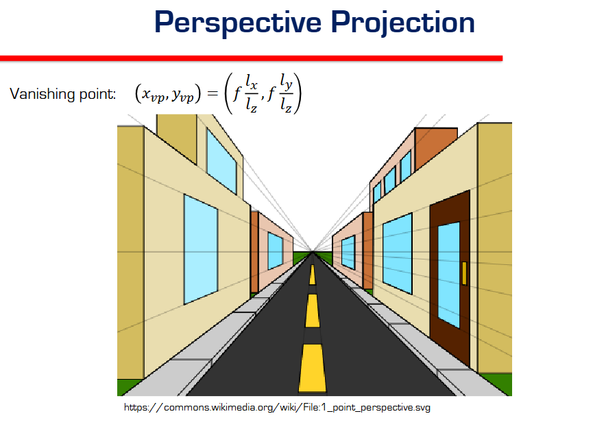
  - **The Question:** "Where exactly will these parallel lines meet?"
  - **The Math:**
    - A line in 3D has a direction vector $\mathbf{v} = (l_x, l_y, l_z)$.
    - Any point on the line is $\mathbf{x} = \mathbf{start} + \lambda \cdot \mathbf{v}$.
    - As we look infinitely far away ($\lambda \rightarrow \infty$), the start point doesn't matter. Only the direction $\mathbf{v}$ matters.
  - **The Formula:**
    $$ (x_{vp}, y_{vp}) = \left( f \frac{l_x}{l_z}, f \frac{l_y}{l_z} \right) $$
  - **Takeaway:**
    - The Vanishing Point depends **ONLY** on the direction of the line $(l_x, l_y, l_z)$.
    - All parallel lines share the same direction, so they all share the same Vanishing Point.

- **Topic: Real Lenses (Physics)**

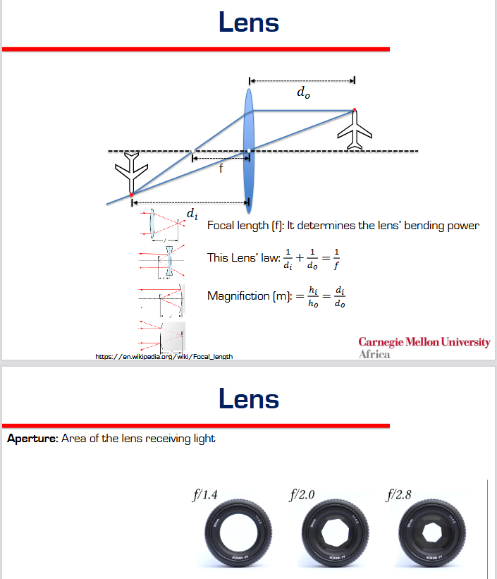
  - **Why not just use a Pinhole?** Pinholes let in too little light. We need a glass lens to gather light.
  - **The Law:** "Thin Lens Equation"
    $$ \frac{1}{d_i} + \frac{1}{d_o} = \frac{1}{f} $$
    - $d_o$: Distance to Object.
    - $d_i$: Distance to Image (Sensor).
  - **Focusing:** Unlike a pinhole (which is always in focus), real lenses must move to satisfy this equation. If $d_o$ changes, $d_i$ must change.
  - **Aperture (The Hole):**
    - **F-Number ($f/N$):** A smaller number (e.g., $f/1.4$) is a **BIGGER** hole.
    - Bigger hole = More light, but BLURRIER background (Depth of Field).
  
  - **FAQ: Wait, is the Lens Intrinsic or not?**
    - **Your Question:** "So the lens itself is NOT an intrinsic feature?"
    - **Correction: IT IS.**
      - The **Focal Length ($f$)** is properties of the glass. It goes directly into the $K$ matrix.
      - **However:** When you mechanically "Focus" (move the lens to change $d_i$), you are slightly changing the effective geometry.
      - **In Computer Vision:** We usually assume the focus is fixed (or at infinity), so $f$ is treated as a **Constant Intrinsic**.

- **Topic: Real Lens Artifacts (The Bad Stuff)**
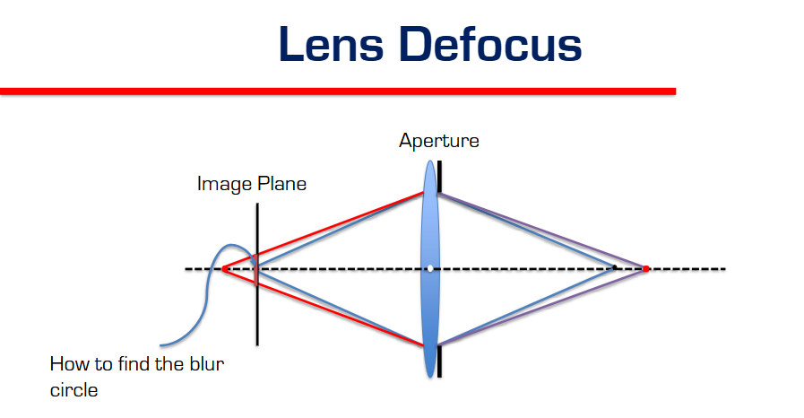 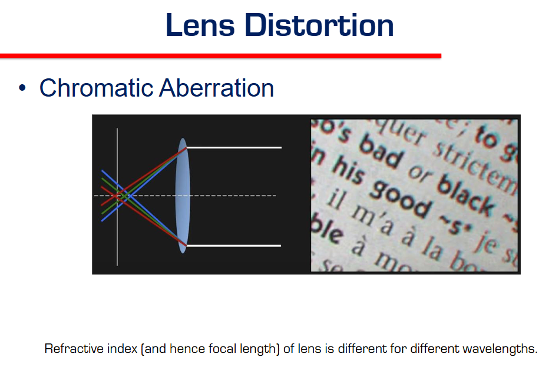 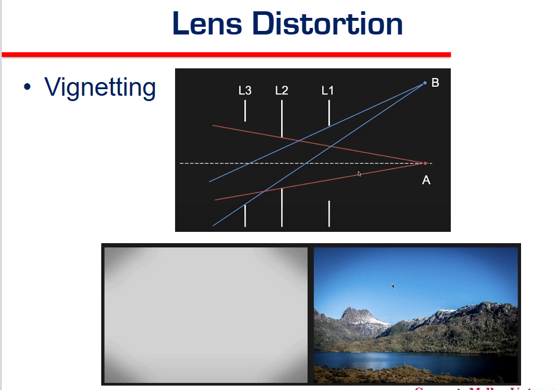
  - **1. Lens Defocus (Blur Circle):**
    - **Cause:** Finite Aperture (Hole is too big).
    - Light rays from a point don't meet perfectly at the sensor. They form a circle instead of a dot.
    - **Result:** Objects at the wrong depth look blurry ($d_o$ doesn't match equation).
  
  - **2. Chromatic Aberration (Color Fringing):**
    - **Cause:** Physics of Glass.
    - Glass bends Blue light more than Red light (Refractive Index depends on wavelength).
    - **Result:** You see "Rainbow Edges" around high-contrast objects (like leaves against a bright sky).
  
  - **3. Vignetting (Dark Corners):**
    - **Cause:** Mechanical Blocking.
    - Light hitting the lens at a steep angle is partially blocked by the lens housing.
    - **Result:** The image is bright in the center and dark/shadowy in the corners.

---

### Part 3: Photometric Image Formation (Intensity)

- **Topic: The Big Shift (Geometry $\rightarrow$ Photometry)**
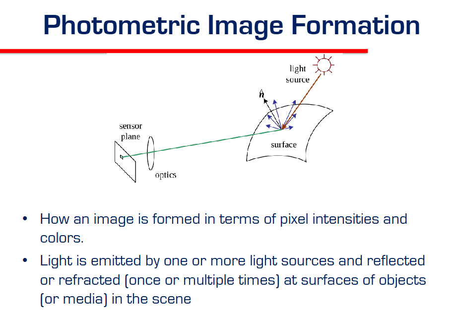
  - **Previous Topic (Geometry):** "Where does this point determine land on the image?" $(x,y)$.
  - **New Topic (Photometry):** "How BRIGHT and what COLOR is that pixel?" $(R,G,B)$.
  - **The Three Players:**
    1.  **Light Source:** Emits photons (Sun, Lamp).
    2.  **Surface:** Interaction (Reflection/Refraction). The object material matters (Shiny vs Matte).
    3.  **Sensor:** Collection. Turning photons into electrons (Intensity).

- **Topic: The Rendering Equation (The Physics of Light)**
<!-- 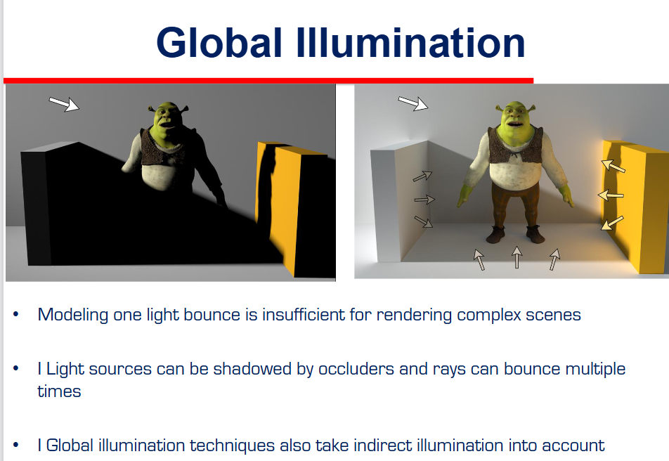 -->
  - **The "Grand Unifying Theory" of Computer Graphics.**
  - **The Equation:**
    $$ L_{out}(v) = L_{emit} + \int_{\Omega} \text{BRDF} \cdot L_{in}(s) \cdot \cos(\theta) \cdot ds $$
  - **English Translation:**
    "The light shooting towards your eye ($L_{out}$) IS EQUAL TO the light the object glows ($L_{emit}$) PLUS the reflection of all incoming light from every direction."
  
  - **The Parts:**
    1.  **$L_{emit}$:** Is the object a lightbulb? (Usually 0).
    2.  **$\int_{\Omega}$ (The Integral):** We must sum up light coming from the *entire hemisphere* around the point.
    3.  **BRDF:** The "Material Function". How shiny is it? (Does it reflect mostly to mirror angle or scatter everywhere?).
    4.  **$L_{in}$:** The incoming light brightness.
    5.  **$-n^T s$ (The Cosine Term):** Geometry penalty. Light hitting at a steep angle is weaker. (Sun at sunset is weaker than noon).

- **Topic: Global Illumination (Bouncing Light)**

  - **The Problem with "Direct Illumination" (Left Image):**
    - If expected light only bounces ONCE (Source $\rightarrow$ Object $\rightarrow$ Eye), shadows are **Pitch Black**.
    - In reality, shadows are rarely black. Why?
  - **The Solution: Global Illumination (Right Image):**
    - Light bounces off the floor, hits the wall, hits Shrek's back, and *then* hits your eye.
    - **Indirect Illumination:**
      - Light travels: Source $\rightarrow$ Wall $\rightarrow$ Object $\rightarrow$ Eye.
      - This "fill light" softens shadows and makes scenes look realistic.
  - **Key Takeaway:** The "Integral" in the Rendering Equation is hard because $L_{in}$ comes from everywhere, including other objects!

- **Topic: BRDF Components (Diffuse vs Specular)**

  - **1. Diffuse Reflection (Matte):**
    - **Behavior:** Light hits and scatters **Equally** in all directions.
    - **Example:** Paper, Wall, Chalk.
    - **Key Property:** **View Independent**. The brightness looks the same no matter where you stand.
  
  - **2. Specular Reflection (Shiny):**
    - **Behavior:** Light bounces mostly in **one direction** (the "Mirror Direction").
    - **Example:** Metal, Plastic, Wet Road.
    - **Key Property:** **View Dependent**. You only see the "glare" or highlight if you are standing in the right spot (Angle of Incidence = Angle of Reflection).
  
  - **3. Mirror (Ideal Specular):**
    - The extreme version where scatter is zero. Perfect reflection.

---

---

---

---

---

---

---

---

---

---

---

---

---

---

---

---

---

---

---

---

---

---

---

---

---

---

---

---

---

---

---

---

---

---

---

---

---

---

## Lecture 2: [Topic Name]

**Slides:** `slides/[filename].pdf` | Pages: 

**Key Concepts:**
- 

**Notes:**
- 

---

## Additional Topics

### Topic: 

**Reference:** 

**Notes:**
- 

---

## Resources

- Course slides in `slides/` folder
- 

---

## To-Do

- [ ] 
