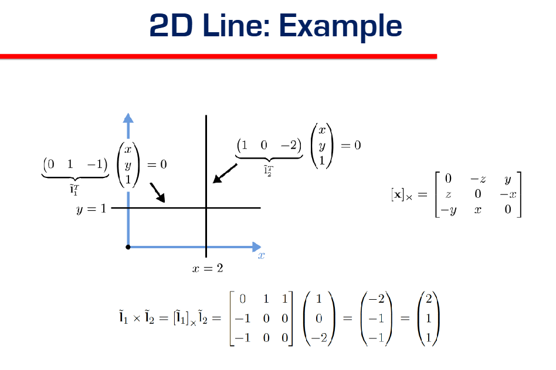
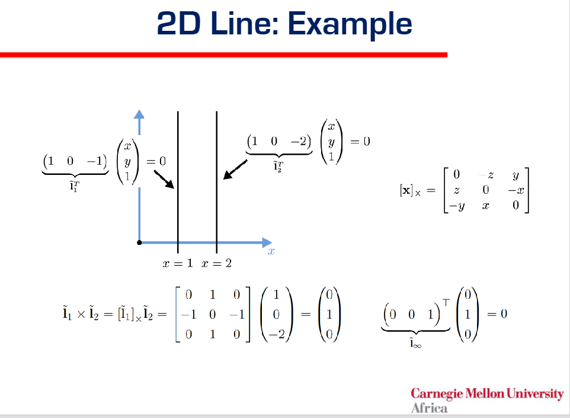
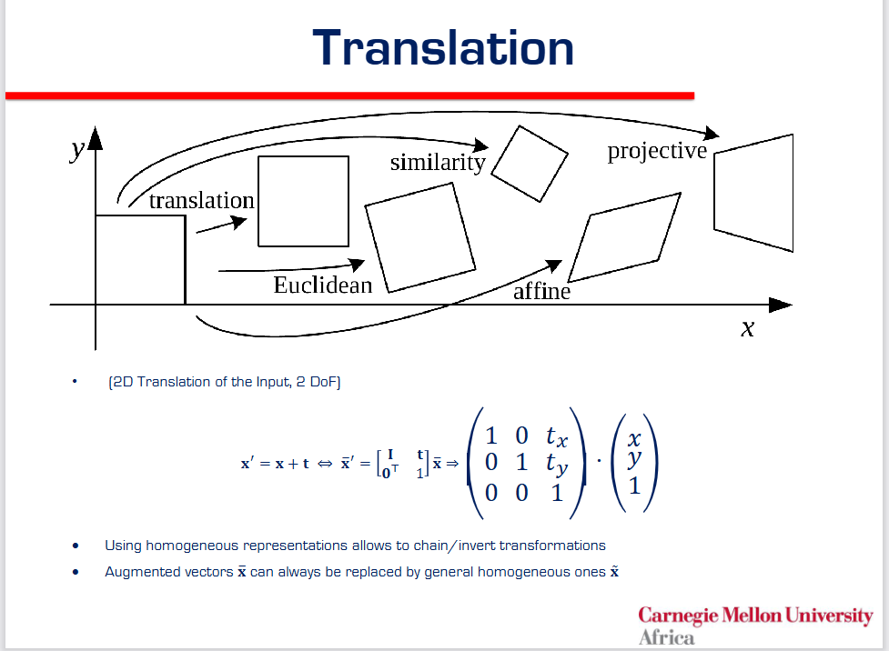
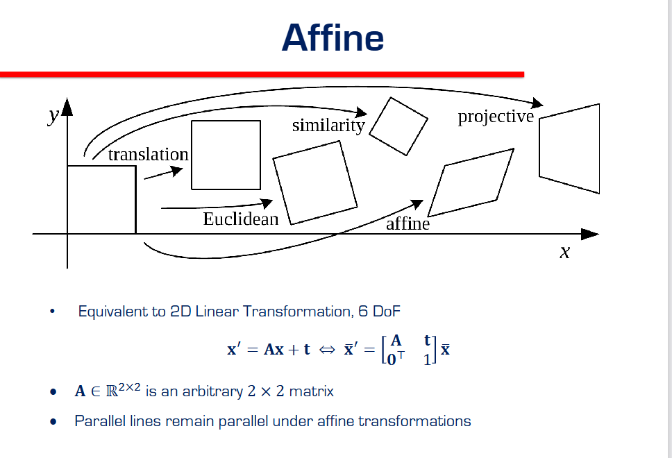

# CV Course Notes

## Date: January 29, 2026

---

## Lecture 1: [Topic Name]

**Slides:** `slides/[filename].pdf` | Pages: 

**Key Concepts:**
- 

**Topic:** 2D Line Representation and Normalization

**Concept Explanation:**
- **Standard Equation:** A general 2D line is given by the equation $ax + by + c = 0$. In homogeneous coordinates, this is represented by the vector $\tilde{l} = (a, b, c)$.
- **Normalization:** To give the coefficients geometric meaning, we normalize the vector so that calculating the magnitude of the normal vector part equals 1.
  - We divide the vector $(a, b, c)$ by $\sqrt{a^2 + b^2}$.
  - The normalized vector is denoted as $l = (\hat{n}_x, \hat{n}_y, d) = (\hat{n}, d)$ where $||\hat{n}|| = 1$.
- **Geometric Interpretation:**
  - $\hat{n} = (\hat{n}_x, \hat{n}_y)$: The **unit normal vector**, which is perpendicular to the line.
  - $d$: The **signed perpendicular distance** from the origin to the line.
- **Exception:** The **line at infinity** $\tilde{l} = (0, 0, 1)$ cannot be normalized this way because the normal vector components $(0,0)$ have a magnitude of 0.

**Questions:**
- 

**Topic:** Figure 2.2 - Geometric Primitives (2D Line & 3D Plane)

**Concept Explanation:**
- **2D Line (Figure 2.2a):** 
  - Represents a line $l$ using the normal $\hat{n}$ and distance $d$. 
  - $d$ is the **perpendicular distance** from the origin to the line. The segment of length $d$ connecting the origin to the line is perpendicular to the line itself.
  - $\hat{n} = (\cos \theta, \sin \theta)$ is the unit normal vector.
  - This corresponds to the **Hough Transform** representation $(\theta, d)$ (where $\theta$ is the angle of the normal).
- **3D Plane (Figure 2.2b):**
  - Represents a plane $m$ in 3D space.
  - Similarly, $d$ is the perpendicular distance from the origin to the plane.
  - $\hat{n}$ is the unit normal vector perpendicular to the plane's surface.
- **Intersections (Homogeneous Coordinates):**
  - **Notation Definition:**
    - $\tilde{x}$: Represents a **Point** in homogeneous coordinates (e.g., $(x, y, 1)$).
    - $\tilde{l}$: Represents a **Line** in homogeneous coordinates (e.g., $(a, b, c)$).
  - **Duality (The "Yeah?": Reference):**
    - **Intersection of two lines $\rightarrow$ Point:** $\tilde{x} = \tilde{l}_1 \times \tilde{l}_2$ (The point $\tilde{x}$ is where lines $\tilde{l}_1$ and $\tilde{l}_2$ meet).
    - **Line joining two points $\rightarrow$ Line:** $\tilde{l} = \tilde{x}_1 \times \tilde{x}_2$ (The line $\tilde{l}$ connects points $\tilde{x}_1$ and $\tilde{x}_2$).

**Topic:** 3D Geometry: Points, Lines, and Planes

**Concept Explanation:**
- **3D Points:**
  - **Inhomogeneous:** $x = (x, y, z) \in \mathcal{R}^3$.
  - **Homogeneous:** $\tilde{x} = (\tilde{x}, \tilde{y}, \tilde{z}, \tilde{w}) \in \mathcal{P}^3$.
  - **Augmented Vector:** Commonly used notation $\bar{x} = (x, y, z, 1)$ (where $\tilde{w}=1$).

- **3D Lines (Figure 2.3 - Parametric Equation):**
  - **Visual:** The diagram shows a 3D line passing through two points, $p$ and $q$.
  - **Equation:** $r = (1 - \lambda)p + \lambda q$.
  - **Explanation:**
    - This is a **parametric representation**. Any point $r$ on the line is defined by the parameter $\lambda$.
    - It represents a weighted combination of the two points $p$ and $q$.
    - If $\lambda = 0$, you are at $p$. If $\lambda = 1$, you are at $q$.
    - If $0 < \lambda < 1$, the point lies between $p$ and $q$ (line segment).

- **3D Planes:**
  - **Homogeneous:** Represented by vector $\tilde{m} = (a, b, c, d)$.
  - **Equation:** $\bar{x} \cdot \tilde{m} = ax + by + cz + d = 0$.
  - **Geometric Interpretation:**
    - Like 2D lines, this can be normalized to $m = (\hat{n}, d)$ with $||\hat{n}|| = 1$.
    - $\hat{n} = (\hat{n}_x, \hat{n}_y, \hat{n}_z)$: The **unit normal vector** perpendicular to the plane.
    - $d$: The perpendicular distance from the origin to the plane.

- **Notation Clarification (The "Hat" $\hat{}$ Symbol):**
  - **Meaning:** The hat symbol (e.g., $\hat{n}, \hat{d}$) typically indicates a **Unit Vector** (a vector with length/magnitude of 1).
  - **Purpose:** Because it has a standard length of 1, it purely represents **Direction**.
  - **Special Case (Line with point at infinity):**
    - usage: $r = p + \lambda \hat{d}$.
    - Here, $p$ is a starting point.
    - $\hat{d}$ is the **direction vector** of the line.
    - This happens when the second point $q$ in the standard equation is a "point at infinity", effectively acting just as a direction pointer.

**Topic:** Degrees of Freedom (DOF) - Basics & Calculation

**Concept Explanation:**
- **What is it?** DOF is the number of **independent** pieces of information required to fully specify a system or object.
- **How to Calculate:**
  $$ \text{DOF} = \text{Total Parameters} - \text{Number of Constraints} $$
  - **Total Parameters:** The number of values you are using to describe the object.
  - **Constraints:** The number of rules or equations those values must satisfy (reducing the freedom).

**Topic:** Degrees of Freedom (DOF) for 3D Lines

**Concept Explanation:**
- **The Core Question:** How many independent numbers do we need to uniquely define a line in 3D space? (Answer: 4)
- **Calculation Examples:**
  1. **Endpoint Representation ($p, q$):** 
     - **Total Parameters:** 6 (two 3D points: $x_1, y_1, z_1$ and $x_2, y_2, z_2$).
     - **Constraints:** 2 (The points can slide independently along the line without changing the line. Each point sliding removes 1 degree of uniqueness/stability for representing that specific locus of points).
     - **Result:** $6 - 2 = 4$.
     - **Clarification on "Sliding":**
       - It does **NOT** mean x, y, or z are constant. They all change as you slide.
       - **What it means:** To define "Line A", you could pick *any* point $P$ on it and *any* point $Q$ on it.
       - Because you have the freedom to move point $P$ anywhere along the infinite length of the line (1 dimension of movement) and still be talking about "Line A", that is **1 redundant degree of freedom**.
       - Same for point $Q$.
       - Total Redundancy = 2.
       - **Analogy:** Naming a street by picking two houses on it. You could pick House 1 and 2, or House 50 and 99. It's the same street (Line). Your choice of *which* houses (points) is the redundancy.
     - **Constraint Check (User Hypothesis):**
       - *Hypothesis:* "If we use 3 points, do we have 6 DOF?"
       - *Correction:* **No.** The Line itself (the object) always has **4 DOF**.
       - Adding a 3rd point just adds more redundancy.
       - math: 9 Parameters (3 points) - 3 Sliding Constraints - 2 Collinearity Constraints (P3 must lie on the line of P1-P2) = **4 DOF**.
       - You cannot change the "freedom" of the geometric object just by using more markers to describe it.
     - **Constraint Check (User Hypothesis 2):**
       - *Hypothesis:* "What if we only have one point?"
       - *Answer:* **Undefined / Impossible.**
       - A single point has **3 DOF** (x, y, z).
       - A Line requires **4 DOF**.
       - You simply do not have enough information. There are infinite lines passing through a single point (imagine a starburst or pin-cushion).
     - **Constraint Check (User Hypothesis 3 - 2D Case):**
       - *Hypothesis:* "If we are in 2D, do we have 2 DOF?"
       - *Answer:* **YES.**
       - **Method 1: Two-Point Calculation (Consistent with your 3D logic):**
         - **Parameters:** 4 Coords (Point 1 has $x_1, y_1$; Point 2 has $x_2, y_2$).
         - **Constraints:** 2 independent slides (Point 1 slides, Point 2 slides).
         - **Result:** $4 - 2 = 2$ DOF.
       - **Method 2: Equation Calculation:**
         - **Parameters:** 3 (Equation $ax + by + c = 0$).
         - **Constraints:** 1 (Scale independence).
         - Result: $3 - 1 = 2$ DOF.
       - *Both methods give the same answer!*
  2. **Plücker Coordinates:**
     - **Total Parameters:** 6 (elements in matrix).
     - **Constraints:** 2 (Homogeneous scale $-1$, Determinant $|L|=0$ constraint $-1$).
     - **Result:** $6 - 2 = 4$.
  - **Two-Plane Parametrization (Visualizing the 4 numbers):** Imagine two parallel planes (e.g., $z=0$ and $z=1$). A line will puncture these planes at two points: $(x_1, y_1)$ on the first plane and $(x_2, y_2)$ on the second. These **4 coordinates** uniquely define the line.
    - Used in **Light Field** and **Lumigraph** rendering.

**Topic:** Page Content Summary (Advanced Representations)

**Concept Explanation:**
- **Plücker Coordinates (Matrix $L$):**
  - Used to represent lines without bias (the two-plane method fails if the line is parallel to the planes).
  - Uses a $4 \times 4$ skew-symmetric matrix $L = \tilde{p}\tilde{q}^T - \tilde{q}\tilde{p}^T$.
  - Defined by 6 values, but homogeneous scaling (-1 DOF) and a determinant constraint $|L|=0$ (-1 DOF) bring it back to **4 DOF**.
- **3D Quadrics:**
  - The 3D version of conics (circles, ellipses).
  - Equation: $\tilde{x}^T Q \tilde{x} = 0$ (defines surfaces like spheres, ellipsoids, cylinders).
  - Useful for modeling simple 3D primitives.

**Topic:** Cross Product & Skew-Symmetric Matrix

**Concept Explanation:**
- **Standard Definition:** The cross product $a \times b$ gives a vector perpendicular to both $a$ and $b$.
  - Typically calculated using the determinant of a matrix with basis vectors $i, j, k$.
  - **What are i, j, k?**
    - They represent the **Standard Basis Vectors** (the directions of the axes).
    - $\mathbf{i} = (1, 0, 0)$ corresponds to the x-axis.
    - $\mathbf{j} = (0, 1, 0)$ corresponds to the y-axis.
    - $\mathbf{k} = (0, 0, 1)$ corresponds to the z-axis.
    - They are placed in the top row of the determinant as "placeholders" so that when you calculate the determinant, the result ends up being a vector $(Result_x, Result_y, Result_z)$.
- **Matrix Representation (The "CV Way"):**
  - In Computer Vision, we often want to write the cross product as a linear algebra operation (Matrix $\times$ Vector).
  - We convert vector **$a$** into a special **Skew-Symmetric Matrix**, denoted as $[a]_\times$.
  - Formula: $a \times b = [a]_\times b$
- **The Skew-Symmetric Matrix $[a]_\times$:**
  $$ [a]_\times = \begin{bmatrix} 0 & -a_3 & a_2 \\ a_3 & 0 & -a_1 \\ -a_2 & a_1 & 0 \end{bmatrix} $$
- **Why do this?**
  - It allows us to treat "crossing with $a$" as just "multiplying by a matrix".
  - Extremely useful for writing equations like Epipolar constraints ($x'^T E x = 0$) later in the course.
- **Derivation: Why are they the same?**
  - **1. Expand the Determinant (Top equation):**
    $$ a \times b = \det \begin{vmatrix} i & j & k \\ a_1 & a_2 & a_3 \\ b_1 & b_2 & b_3 \end{vmatrix} $$
    - $i(a_2 b_3 - a_3 b_2)$
    - $-j(a_1 b_3 - a_3 b_1) = j(a_3 b_1 - a_1 b_3)$
    - $+k(a_1 b_2 - a_2 b_1)$
    - **Result Vector:** $(a_2 b_3 - a_3 b_2, \quad a_3 b_1 - a_1 b_3, \quad a_1 b_2 - a_2 b_1)$
  - **2. Multiply the Matrix (Bottom equation):**
    $$ [a]_\times b = \begin{bmatrix} 0 & -a_3 & a_2 \\ a_3 & 0 & -a_1 \\ -a_2 & a_1 & 0 \end{bmatrix} \begin{pmatrix} b_1 \\ b_2 \\ b_3 \end{pmatrix} $$
    - Row 1: $0(b_1) - a_3(b_2) + a_2(b_3) = \mathbf{a_2 b_3 - a_3 b_2}$
    - Row 2: $a_3(b_1) + 0(b_2) - a_1(b_3) = \mathbf{a_3 b_1 - a_1 b_3}$
    - Row 3: $-a_2(b_1) + a_1(b_2) + 0(b_3) = \mathbf{a_1 b_2 - a_2 b_1}$
  - **Conclusion:** The results are identical. The matrix is just "factored out" coefficients from the determinant result.

- **Deep Dive: How did they build that matrix? (The Missing Step)**
  - **Goal:** We want to separate vector $b$ from the equation so it looks like $[Matrix] \cdot b$.
  - **Method:** Look at the Result Vector and "factor out" $b_1, b_2, b_3$.
  - **Row 1:** $a_2 b_3 - a_3 b_2$
    - Rewrite as: $(0)b_1 + (-a_3)b_2 + (a_2)b_3$
    - Coefficients become Row 1 of matrix: $[0, \quad -a_3, \quad a_2]$
  - **Row 2:** $a_3 b_1 - a_1 b_3$
    - Rewrite as: $(a_3)b_1 + (0)b_2 + (-a_1)b_3$
    - Coefficients become Row 2 of matrix: $[a_3, \quad 0, \quad -a_1]$
  - **Row 3:** $a_1 b_2 - a_2 b_1$
    - Rewrite as: $(-a_2)b_1 + (a_1)b_2 + (0)b_3$
    - Coefficients become Row 3 of matrix: $[-a_2, \quad a_1, \quad 0]$

    

**Topic:** Example: 2D Line Intersection

**Concept Explanation:**
- **Goal:** Find where the line $y=1$ and $x=2$ intersect using Homogeneous Geometry.
- **Step 1: Define the Lines ($\tilde{l}$):**
  - **Line 1 ($y = 1$):**
    - Equation: $0x + 1y - 1 = 0$
    - Vector: $\tilde{l}_1 = (0, 1, -1)^T$
  - **Line 2 ($x = 2$):**
    - Equation: $1x + 0y - 2 = 0$
    - Vector: $\tilde{l}_2 = (1, 0, -2)^T$
- **Step 2: Calculate Intersection ($\tilde{x} = \tilde{l}_1 \times \tilde{l}_2$):**
  - Using Matrix Method: $\tilde{x} = [\tilde{l}_1]_\times \tilde{l}_2$
  - Matrix $[l_1]_\times = \begin{bmatrix} 0 & -(-1) & 1 \\ -1 & 0 & -(0) \\ -1 & 0 & 0 \end{bmatrix} = \begin{bmatrix} 0 & 1 & 1 \\ -1 & 0 & 0 \\ -1 & 0 & 0 \end{bmatrix}$
  - Calculation:
    $$ \begin{bmatrix} 0 & 1 & 1 \\ -1 & 0 & 0 \\ -1 & 0 & 0 \end{bmatrix} \begin{pmatrix} 1 \\ 0 \\ -2 \end{pmatrix} = \begin{pmatrix} -2 \\ -1 \\ -1 \end{pmatrix} $$
  - Result Vector: $\tilde{x} = (-2, -1, -1)^T$
- **Step 3: Convert to Cartesian Point:**
  - $\tilde{x} = (-2, -1, -1)$
  - Divide by $w$ ($w = -1$):
  - $x = -2 / -1 = 2$
  - $y = -1 / -1 = 1$
  - **Final Point:** $(2, 1)$, which matches the graph!

- **Concept Check: Why are the $z$ values -1 and -2?**
  - **Question:** Looking at the graph, we see $y=1$ and $x=2$. Why do the vectors have $-1$ and $-2$?
  - **Answer:** It comes from the **Standard Form** Requirement: $ax + by + c = 0$.
  - **For Line 1:**
    - Start: $y = 1$
    - Move to match form ($=0$): $0x + 1y - 1 = 0$
    - Extract Coefficients: $(0, 1, \mathbf{-1})$
  - **For Line 2:**
    - Start: $x = 2$
    - Move to match form ($=0$): $1x + 0y - 2 = 0$
    - Extract Coefficients: $(1, 0, \mathbf{-2})$
  - **Rule of Thumb:** If the line equation equals a positive constant, that constant becomes negative when put into the vector.
  - **Intuition (The "Cancel Out" Effect):**
    - Recall the dot product rule: $\tilde{x} \cdot \tilde{l} = 0$.
    - If you have a point at $x=2$ (component is $+2$), you necessarily need a $-2$ in the line vector to "cancel it out" and reach zero.
    - $1(2) + ... + (-2)(1) = 0$.
    - Values must oppose each other to sum to zero.

    ---

**Topic:** Example 2: Parallel Lines Intersection (Points at Infinity)

**Concept Explanation:**
- **Goal:** Find intersection of two **parallel** lines: $x=1$ and $x=2$.
- **Step 1: Vectors:**
  - $x=1 \rightarrow 1x + 0y - 1 = 0 \rightarrow \tilde{l}_1 = (1, 0, -1)^T$.
  - $x=2 \rightarrow 1x + 0y - 2 = 0 \rightarrow \tilde{l}_2 = (1, 0, -2)^T$.
- **Step 2: Intersection ($\tilde{x} = \tilde{l}_1 \times \tilde{l}_2$):**
  - $\tilde{x} = \begin{bmatrix} 0 & -(-1) & 0 \\ -1 & 0 & -1 \\ -0 & 1 & 0 \end{bmatrix} \begin{pmatrix} 1 \\ 0 \\ -2 \end{pmatrix}$
  - *Correction on Cross Product Math:*
    - $i(0(-2) - 0(0)) = 0$
    - $-j(-2 - (-1)) = -j(-1) = 1$
    - $k(0 - 0) = 0$
  - **Result:** $\tilde{x} = (0, 1, 0)^T$.
- **Step 3: Interpretation:**
  - $\tilde{x} = (0, 1, 0)$.
  - **Coordinate $w = 0$:** This means it is a **Point at Infinity** (Ideal Point).
  - **Direction:** The point lies in the direction $(0, 1)$, which is the **vertical axis (y-axis)**.
  - **Conclusion:** Two vertical parallel lines meet at the "vertical infinity".
- **Check with Line at Infinity ($\tilde{l}_\infty$):**
  - The Line at Infinity is $\tilde{l}_\infty = (0, 0, 1)^T$.
  - Does our point lie on it?
  - $\tilde{l}_\infty^T \tilde{x} = (0, 0, 1) \cdot (0, 1, 0) = 0$.
  - **Yes.** All parallel intersections lie on the Line at Infinity.

  - **Yes.** All parallel intersections lie on the Line at Infinity.

**Topic:** 2D Translation & Transformation Hierarchy

**Concept Explanation:**
- **The Hierarchy:** The slide shows how shapes can be distorted in increasingly complex ways:
  1.  **Translation:** Just moving the shape (Shift).
  2.  **Euclidean:** Moving + Rotating (Rigid body).
  3.  **Similarity:** Moving + Rotating + Scaling (Shape stays same, size changes).
  4.  **Affine:** Parallel lines stay parallel (Shear / Squash).
  5.  **Projective:** Parallel lines converge (Perspective).

- **Focus: 2D Translation:**
  - **DOF:** 2 Degrees of Freedom ($t_x, t_y$).
  - **Standard Math:** $x' = x + t$ (Addition).
  - **Homogeneous Math (The Power Move):**
    - By adding that extra '1' to make it a vector $(x, y, 1)$, we can turn "addition" into "multiplication".
    - Matrix Equation:
      $$ \begin{pmatrix} x' \\ y' \\ 1 \end{pmatrix} = \begin{bmatrix} 1 & 0 & t_x \\ 0 & 1 & t_y \\ 0 & 0 & 1 \end{bmatrix} \begin{pmatrix} x \\ y \\ 1 \end{pmatrix} $$
    - **Check:**
      - Row 1: $1(x) + 0(y) + t_x(1) = x + t_x$ (Correct!)
      - Row 2: $0(x) + 1(y) + t_y(1) = y + t_y$ (Correct!)
      - Row 2: $0(x) + 1(y) + t_y(1) = y + t_y$ (Correct!)
  - **Clarification on $\mathbf{t}$:**
    - Yes, $\mathbf{t} = (t_x, t_y)$ represents the **linear shift** or distance moved.
    - $t_x$: How much you move to the right (positive) or left (negative).
    - $t_y$: How much you move up (positive) or down (negative).
    - It is literally just the "Offset" added to the original position.
  - **Why?** This block structure $\begin{bmatrix} I & t \\ 0^T & 1 \end{bmatrix}$ allows us to **chain** multiple transformations (rotation, scale, translation) by just multiplying matrices together.

**Topic:** Affine Transformations

**Concept Explanation:**
- **Definition:** A linear transformation (Rotation, Scale, Shear) followed by a Translation.
- **Degrees of Freedom (DOF):** 6 DOF.
  - **4 Linear Params:** The $2 \times 2$ matrix $A$ has 4 independent values ($a, b, c, d$). These handle rotation, scaling, and shearing.
  - **2 Translation Params:** The vector $t$ has 2 independent values ($t_x, t_y$).
  - Total: $4 + 2 = 6$.
- **Matrix Form:**
  $$ H_{affine} = \begin{bmatrix} A & t \\ 0^T & 1 \end{bmatrix} $$
  - where $A$ is an arbitrary $2 \times 2$ matrix.
- **Key Property:** **Parallel Lines remain Parallel.**
  - This is the "golden rule" of Affine transformations.
  - You can squash a square into a parallelogram (shear), but the top and bottom sides will still be parallel to each other.
  - It does **not** preserve angles (rectangles can become sloped) or lengths, but it preserves "parallelism".

---

---

---

## Lecture 2: [Topic Name]

**Slides:** `slides/[filename].pdf` | Pages: 

**Key Concepts:**
- 

**Notes:**
- 

---

## Additional Topics

### Topic: 

**Reference:** 

**Notes:**
- 

---

## Resources

- Course slides in `slides/` folder
- 

---

## To-Do

- [ ] 
