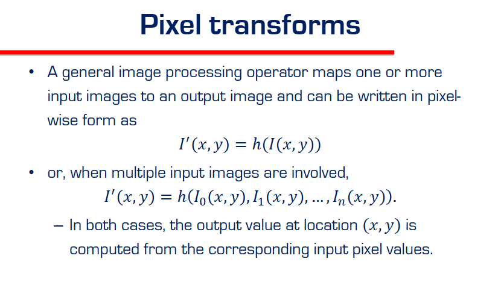

# CV Course Notes - Image Processing

## Date: February 1, 2026

---

## Lecture 2: Image Processing

**Slides:** `slides/2 Image Processing.pdf` 

**Key Concepts:**
- Pixel transforms (point-wise operations)
- Sampling and quantization
- Filtering and convolution

---

### Topic: Pixel Transforms (Point Operations)

  - **Definition:**
    - An image processing operator that maps input image(s) to an output image.
    - Output at $(x,y)$ depends **only** on input at that same location — **point-wise**.

  - **Single Image Transform:**
    $$ I'(x,y) = h(I(x,y)) $$
    - $I(x,y)$: Input pixel value at position $(x,y)$.
    - $h(\cdot)$: The transformation function.
    - $I'(x,y)$: Output pixel value.

  - **Examples of Single Image Transforms:**
    | Transform | Formula | Effect |
    | :--- | :--- | :--- |
    | Brightness | $h(p) = p + c$ | Add constant to all pixels |
    | Contrast | $h(p) = a \cdot p$ | Multiply all pixels |
    | Inversion | $h(p) = 255 - p$ | Flip black ↔ white |
    | Threshold | $h(p) = \begin{cases} 255 & p > T \\ 0 & \text{else} \end{cases}$ | Binary image |
    | Gamma | $h(p) = p^\gamma$ | Non-linear brightness |

  - **Multiple Image Transform:**
    $$ I'(x,y) = h(I_0(x,y), I_1(x,y), ..., I_n(x,y)) $$
    - Combines pixels from **multiple images** at the same location.

  - **Examples of Multi-Image Transforms:**
    | Transform | Formula | Use Case |
    | :--- | :--- | :--- |
    | Averaging | $\frac{I_0 + I_1}{2}$ | Blending, noise reduction |
    | Difference | $|I_0 - I_1|$ | Motion detection, change detection |
    | Max/Min | $\max(I_0, I_1)$ | HDR, compositing |

  - **Key Insight:**
    - Pixel transforms are **embarrassingly parallel** — each pixel is independent.
    - Very fast on GPUs!

---

### Topic: Basic Intensity Transformations

#### Notation Key (Variables):
- **$r$**: **Input** pixel intensity (value *before* transform).
- **$s$**: **Output** pixel intensity (value *after* transform).
- **$L$**: **Number of gray levels** (Total possible values).
  - For 8-bit images, $L = 2^8 = 256$.
  - The range of values is $[0, L-1]$ (i.e., 0 to 255).
- **$c$**: A constant scaling factor (usually 1, or calculated to fit the range).
- **$\gamma$ (gamma)**: A power parameter that controls the curve shape.

#### 1. Negative Transform

- **Formula:** $s = L-1 - r$ (where $L=256$ for 8-bit, so $s = 255 - r$)
- **Concept:** Inverts pixel values (0 $\to$ 255, 255 $\to$ 0).
- **Use Case:** Enhancing white or gray details embedded in dark regions of an image (e.g., Digital Mammograms).

#### 2. Logarithmic Transform

- **Formula:** $s = c \log(1 + r)$
- **Concept:**
  - Maps a **narrow range of dark input values** to a **wider range of output values**.
  - Compresses high-value (bright) ranges.
- **Use Case:** Displaying images with huge dynamic range, like the **Fourier Spectrum** (where values range from 0 to $10^6$). It allows you to see the details in the dark parts.

#### 3. Power-Law (Gamma) Transform

- **Formula:** $s = c r^\gamma$
- **Concept:**
  - $\gamma < 1$: **Expands dark values** (makes image brighter/washed out).
  - $\gamma > 1$: **Compresses dark values** (makes image darker/higher contrast).
  - $\gamma = 1$: Linear (Identity).
- **Use Case:** **Gamma Correction**. Monitors naturally darken images ($\gamma \approx 2.2$), so we apply inverse gamma to pre-correct brightness.

#### 4. Contrast Stretching (Piecewise Linear)

- **Formula:** Piecewise linear function defined by points $(r_1, s_1)$ and $(r_2, s_2)$.
- **Concept:** Increase the dynamic range of the gray levels in the image being processed.
- **Key Points:**
  - If $r_1=s_1$ and $r_2=s_2$: It's the Identity function (no change).
  - If $r_1=r_2, s_1=0, s_2=L-1$: It becomes a **Thresholding** function.
  - Intermediate shapes **stretch** specific ranges of gray levels.

#### 5. Intensity-Level Slicing

- **Goal:** Highlight a specific **range of interest** $[A, B]$ (e.g., finding a tumor or specific water mass).
- **Two Approaches:**
  1.  **Binary (Left Graph):** Display all values in range $[A, B]$ as White (high), and everything else as Black (low). (Useful for segmentation).
  2.  **Preserve Background (Right Graph):** Brighten the range $[A, B]$ (jump up) but keep the other gray levels the same. (Useful for visualization without losing context).

---

### Topic: Compositing and Matting (Alpha Blending)

- **The Concept:** How do we put a foreground object (like a character) on top of a background image?
- **The Formula (Alpha Blend):**
  $$ C = (1 - \alpha)B + \alpha F $$
  - **$C$**: Composite Image (Result).
  - **$B$**: Background Image.
  - **$F$**: Foreground Image.
  - **$\alpha$ (Alpha Channel):**
    - A value between $0$ and $1$ (or 0-255).
    - Measures **Opacity** (how solid the foreground is).
    - $\alpha = 1$: Fully Foreground (Opaque).
    - $\alpha = 0$: Fully Background (Transparent).
    - $\alpha = 0.5$: 50% blend (Ghost-like).

- **Interpretation:**
  - We attenuate (weaken) the background by $(1-\alpha)$.
  - We add the influence of the foreground by $\alpha$.

- **Visual Example Breakdown (The Bottom Row):**
  1.  **$B$ (Background) - (a):** The Blue/Green checkerboard.
  2.  **$\alpha$ (Alpha Matte) - (b):** The transparency mask.
      - **White:** Opaque (Foreground shows).
      - **Black:** Transparent (Background shows).
      - **Gray:** Semi-transparent blending.
  3.  **$\alpha F$ (Premultiplied Foreground) - (c):** The brown texture, but **only** where the mask allows it. The rest is black (0).
  4.  **$C$ (Composite) - (d):** The final result. Ideally, it looks like a brown dirty smudge **on top of** the blue checkerboard.

---

### Topic: Histogram Equalization

- **The Problem (Top Image):**
  - The histogram shows all pixels bunched up on the left (dark values).
  - The image is dark and low-contrast.
  - Most of the available dynamic range (right side) is wasted.

- **The Solution (Bottom Image):**
  - **Histogram Equalization** creates a transformation that **spreads out** the intensity values to cover the entire range $[0, 255]$.
  - Ideally, it aims for a **Uniform Histogram** (flat shape).

- **The Result:**
  - Massive increase in **Global Contrast**.
  - Previously hidden details become visible.
  - The image looks "fully lit" rather than "in the shadows".

- **How it Works (Math Intuition):**
  - It uses the **CDF (Cumulative Distribution Function)** of the image intensity.
  - By mapping pixel values through the CDF, the resulting probability density becomes uniform.

- **Example Calculation ($4 \times 4$ Image, 3-bit):**

  1.  **Setup:**
      - Image Size $N = 16$ pixels.
      - Gray Levels $L = 8$ (Values $0$ to $7$).
      - Formula: $T(k) = \text{floor}\left( (L-1) \cdot F(k) \right) = \text{floor}\left( 7 \cdot F(k) \right)$.

  2.  **Step-by-Step Table:**
      | Level $k$ | Count $h(k)$ | PDF $p(k)$ | CDF $F(k)$ | Calc $(7 \times F)$ | Final $T(k)$ |
      | :--- | :--- | :--- | :--- | :--- | :--- |
      | **0** | 2 | 0.1250 | 0.1250 | 0.875 | **0** |
      | **1** | 3 | 0.1875 | 0.3125 | 2.1875 | **2** |
      | **2** | 3 | 0.1875 | 0.5000 | 3.500 | **3** |
      | **3** | 2 | 0.1250 | 0.6250 | 4.375 | **4** |
      | **4** | 3 | 0.1875 | 0.8125 | 5.6875 | **5** |
      | **5** | 0 | 0.0000 | 0.8125 | 5.6875 | **5** |
      | **6** | 2 | 0.1250 | 0.9375 | 6.5625 | **6** |
      | **7** | 1 | 0.0625 | 1.0000 | 7.000 | **7** |

  3.  **Applying the Mapping (Matrix Update):**
      - Original Matrix $\to$ Equalized Matrix ($I'$):
        - Replace every **1** with **2**.
        - Replace every **3** with **4**.
        - Replace every **5** with **5** (no change).
        - (See how values are spread out?)

---

### Topic: Adaptive Histogram Equalization (AHE)

- **The Motivation:**
  - **Global** Histogram Equalization uses one transformation for the whole image.
  - **Problem:** If an image has very different lighting regions (e.g., a dark room with a bright window), global EQ might wash out the bright parts or fail to brighten the dark parts enough.

- **The Solution (Local/Adaptive):**
  - **Method:** Subdivide the image into small blocks (e.g., $M \times M$ regions).
  - Perform Histogram Equalization **separately** for each block.
  - This adapts the contrast enhancement to the **local** neighborhood.

- **The Challenge (Blocking Artifacts):**
  - **Middle Image:** If you just process independent blocks, you see sharp lines/checkerboards at the borders.
  - This happens because the transformation function changes abruptly from one block to the next.

- **The Fix (Smoothing):**
  - **Moving Window:** Calculate the histogram for a window centered at *every* pixel (computationally expensive).
  - **Interpolation (CLAHE):** Calculate histograms on a grid, then **bilinearly interpolate** the transformation function for pixels in between grid points.
  - **Right Image:** The result is smooth local contrast everywhere.

---

### Topic: Linear Filtering (Convolution)

- **The Big Shift:**
  - Previous topics (Pixel Transforms) processed pixels **one at a time** (independently).
  - **Filtering** computes an output pixel based on its **neighbors**.

- **Definition:**
  - Linear filtering computes each output pixel as a **linear combination** (weighted sum) of neighboring input pixels.
  - **Formula:**
    $$ I'(x,y) = \sum_{i,j} h(i,j) I(x-i, y-j) $$
  - **$h(i,j)$**: The **Filter Kernel** (or Mask). A small matrix of weights.

- **The Kernel (Mask):**
  - A small matrix (e.g., $3 \times 3$, $5 \times 5$).
  - It slides over the image.
  - **Example Kernel ($3 \times 3$):**
    $$ h = \begin{bmatrix} h_{-1,-1} & h_{-1,0} & h_{-1,1} \\ h_{0,-1} & h_{0,0} & h_{0,1} \\ h_{1,-1} & h_{1,0} & h_{1,1} \end{bmatrix} $$
  - **Kernel Size:** Controls the scale. Larger kernel = blurrier result (more neighbors averaged).

- **Why use Filtering?**
  - Blurring / Denoising (Smoothing).
  - Sharpening (Enhancing texture).
  - Edge Detection (Finding gradients).

---

### Topic: Gaussian Filtering (Smoothing)

- **Concept:** Spatially weighted averaging.
  - Unlike a "Box Filter" (where all neighbors have weight 1), a Gaussian gives **more weight to the center** and less to the edges.
  - This results in a smoother, more natural blur without blocky artifacts.

- **The Formula (2D Gaussian):**
  $$ h(x,y) = \frac{1}{2\pi\sigma^2} e^{-\frac{x^2+y^2}{2\sigma^2}} $$
  - **$\sigma$ (Sigma):** Controls the **amount of blur**.
    - Small $\sigma$: Sharp peak, slight blur.
    - Large $\sigma$: Flat mound, heavy blur.

- **Discrete Approximation ($3 \times 3$ Kernel for $\sigma \approx 1$):**
  $$ h = \frac{1}{16} \begin{bmatrix} 1 & 2 & 1 \\ 2 & 4 & 2 \\ 1 & 2 & 1 \end{bmatrix} $$
  - **Why divide by 16?** The weights sum to $1+2+1+2+4+2+1+2+1 = 16$.
  - **Normalization:** Dividing by the sum ensures the image doesn't get brighter or darker (Preserves average intensity).

---

### Example: Convolution Calculation Step-by-Step

Let's derive how the **Green Output Pixel (92)** was calculated.

1.  **Select the Input Patch:**
    - The output pixel is at position $(2, 2)$. We look at the $3 \times 3$ input block centered at the same location (the pixel with value **96**).
    - **Input Patch ($3 \times 3$):**
      $$ \begin{bmatrix} 65 & 98 & 123 \\ 65 & \mathbf{96} & 115 \\ 63 & 91 & 107 \end{bmatrix} $$

2.  **Align the Kernel:**
    - **Kernel ($3 \times 3$):**
      $$ \begin{bmatrix} 0.1 & 0.1 & 0.1 \\ 0.1 & \mathbf{0.2} & 0.1 \\ 0.1 & 0.1 & 0.1 \end{bmatrix} $$

3.  **Multiply and Sum (Element-wise):**
    - **Neighbors (Wait 0.1):**
      $$ 0.1 \times (65 + 98 + 123 + 65 + 115 + 63 + 91 + 107) $$
      $$ 0.1 \times (727) = \mathbf{72.7} $$
    - **Center (Weight 0.2):**
      $$ 0.2 \times (96) = \mathbf{19.2} $$
    - **Total:**
      $$ 72.7 + 19.2 = 91.9 $$

4.  **Final Result:**
    - Round to nearest integer $\to$ **92**.
    - This matches the value in the green box!

---

### Formula Decoder: $g(i,j) = \sum_{k,l} f(i+k, j+l)h(k,l)$

This formula is just "Math Speak" for the Sliding Window operation.
- **$g(i,j)$**: The **Output Pixel** at location $(i,j)$.
- **$\sum_{k,l}$**: "Sum up everything inside the kernel".
- **$f(i+k, j+l)$**: The **Image Pixel** currently under the mask.
  - $i, j$ is the center position.
  - $k, l$ are the offsets (e.g., -1, 0, +1).
  - So if $k=-1, l=-1$, we are looking at the top-left neighbor.
- **$h(k,l)$**: The **Kernel Weight** at that offset.

**Simplest Translation:**
> "To get the answer ($g$), loop through every neighbor ($k,l$). Multiply the image pixel ($f$) by the matching kernel weight ($h$). Then add them all up."

*Note: The slide shows "Correlation" (plus signs). If you see "Convolution" (minus signs), it just means the kernel is flipped upside down first. For symmetric kernels like Gaussian, they are identical.*

---

### Convolution vs. Correlation (The Math Technicality)

1.  **Correlation ($g = f \otimes h$):**
    - Formula: $g(i,j) = \sum_{k,l} f(i+k, j+l)h(k,l)$
    - The kernel matches the image directly (like template matching).
    - **Use Case:** Finding a specific shape/feature.

2.  **Convolution ($g = f * h$):**
    - Formula: $g(i,j) = \sum_{k,l} f(i-k, j-l)h(k,l)$
    - **Key Difference:** The signs are reversed (minus $k, l$).
    - This corresponds to **flipping the kernel** both horizontally and vertically before applying it.
    - **Why?** It ensures mathematical properties (associativity) hold.

3.  **LSI (Linear Shift-Invariant):**
    - Both operators are **Linear** (Weighted Sums).
    - Both are **Shift-Invariant** (The rule doesn't change depending on where you are in the image).
    - This means they obey the **Superposition Principle**.

---

### Visualizing Convolution: The "Flip" ($180^\circ$ Rotation)

When performing **Convolution**, you must first **flip the kernel** horizontally and vertically (rotate $180^\circ$) before sliding it.

**Example from Slide:**
1.  **Original Kernel ($\omega$):**
    $$ \begin{bmatrix} 1 & -1 & -1 \\ 1 & 2 & -1 \\ 1 & 1 & 1 \end{bmatrix} $$

2.  **Rotated $180^\circ$ (Flipped Kernel):**
    - Bottom-Right becomes Top-Left.
    - Top-Left becomes Bottom-Right.
    $$ \begin{bmatrix} 1 & 1 & 1 \\ -1 & 2 & 1 \\ -1 & -1 & 1 \end{bmatrix} $$

3.  **Calculation (Overlaying on top-left of Image):**
    - **Image Patch:**
      $$ \begin{bmatrix} 2 & 2 & 2 \\ 2 & 1 & 3 \\ 2 & 2 & 1 \end{bmatrix} $$
    - **Operation:** Element-wise multiply with the **Flipped Kernel**, then sum.
    - **Math:**
      - Row 1: $(1\cdot2) + (1\cdot2) + (1\cdot2) = 6$
      - Row 2: $(-1\cdot2) + (2\cdot1) + (1\cdot3) = 3$
      - Row 3: $(-1\cdot2) + (-1\cdot2) + (1\cdot1) = -3$
      - **Total:** $6 + 3 - 3 = \mathbf{6}$.
    *(Note: The slide sequence shows a "5", which implies a slightly different kernel in the animation, but the **process** is exactly this weighted sum using the flipped matrix).*

---

### Why Edges are Tricky (The "Shrinking" Image)
You correctly noticed that **"the sliding is not touching the edges"**.
- A $3 \times 3$ kernel needs a full set of 9 neighbors.
- **Problem:** Pixels at the very edge (Row 0, Col 0, etc.) don't have neighbors on the top or left!
- **Consequence (Valid Convolution):** We simply **skip** the edges.
  - The output image is **smaller** than the input.
  - If Input is $4 \times 4$ and Kernel is $3 \times 3$, Output is $2 \times 2$.
  - (The slide shows a $4 \times 4$ output grid, but purely to show where the valid pixels *would* land. The empty white cells are undefined/skipped).

### Verified Calculation Example (Manual Proof)
Let's do a calculation from scratch to prove the mechanism (ignoring potential slide typos):

**Setup:**
- **Input Patch ($3 \times 3$):**
  $$ \begin{bmatrix} 10 & 10 & 10 \\ 10 & \mathbf{50} & 10 \\ 10 & 10 & 10 \end{bmatrix} $$
- **Kernel (Assymetric):**
  $$ \begin{bmatrix} 0 & 1 & 0 \\ -1 & 2 & -1 \\ 0 & 1 & 0 \end{bmatrix} $$

**Step 1: Flip the Kernel ($180^\circ$):**
- Top $\leftrightarrow$ Bottom, Left $\leftrightarrow$ Right.
- Value at $(0,1)$ moves to $(2,1)$, etc.
- **Flipped Kernel:**
  $$ \begin{bmatrix} 0 & 1 & 0 \\ -1 & 2 & -1 \\ 0 & 1 & 0 \end{bmatrix} $$
  *(In this specific case, it's symmetric, so it looks the same. But we did flip it!)*

**Step 2: Multiply & Sum:**
- Center: $50 \times 2 = 100$.
- Up/Down Neighbors: $10 \times 1 + 10 \times 1 = 20$.
- Left/Right Neighbors: $10 \times (-1) + 10 \times (-1) = -20$.
- Corners: $10 \times 0 = 0$.
- **Total:** $100 + 20 - 20 = \mathbf{100}$.

This confirms the logic: **Flip $\to$ Overlay $\to$ Sum.**

---

### Walkthrough: The Full Slide Sequence (Steps 1-4)
You provided 5 images showing the kernel sliding. Here is exactly what happens in each frame:

**Global Setup:**
- Input Image ($4 \times 4$).
- Kernel ($3 \times 3$).
- **Flipped Kernel:** $\begin{bmatrix} 1 & 1 & 1 \\ -1 & 2 & 1 \\ -1 & -1 & 1 \end{bmatrix}$ (This is what we multiply by).

#### Step 1: Top-Left Output (Red Box = 5)
- **Position:** Overlay kernel on Top-Left $3 \times 3$ block of Image.
- **Values under Kernel:** $\begin{bmatrix} 2&2&2 \\ 2&1&3 \\ 2&2&1 \end{bmatrix}$
- **Calculated Sum:** 5 (based on slide).
- **Result:** Written to output position $(0,0)$.

#### Step 2: Top-Right Output (Red Box = 4)
- **Position:** Slide kernel **1 pixel Right**.
- **Values under Kernel:** $\begin{bmatrix} 2&2&3 \\ 1&3&3 \\ 2&1&2 \end{bmatrix}$ (The right-most $3 \times 3$ block).
- **Calculated Sum:** 4.
- **Result:** Written to output position $(0,1)$.

#### Step 3: Bottom-Left Output (Red Box = 4)
- **Position:** Slide kernel **1 pixel Down** (to the start of the next row).
- **Values under Kernel:** $\begin{bmatrix} 2&1&3 \\ 2&2&1 \\ 1&3&2 \end{bmatrix}$ (Bottom-left $3 \times 3$ block).
- **Calculated Sum:** 4.
- **Result:** Written to output position $(1,0)$.

#### Step 4: Bottom-Right Output (Red Box = -2)
- **Position:** Slide kernel **1 pixel Right** again.
- **Values under Kernel:** $\begin{bmatrix} 1&3&3 \\ 2&1&2 \\ 3&2&2 \end{bmatrix}$ (Bottom-right $3 \times 3$ block).
- **Calculated Sum:** -2.
- **Result:** Written to output position $(1,1)$.

**The Final Output:** A $2 \times 2$ grid: $\begin{bmatrix} 5 & 4 \\ 4 & -2 \end{bmatrix}$.

---

### The "Golden Rule" of Convolution
You nailed it! The operation is exactly:

$$ \text{Result} = \sum (\text{Image Pixel} \times \text{Kernel Pixel}) $$

1.  **Overlay** the flipped kernel.
2.  **Multiply** every pair of numbers that are touching.
3.  **Add** all those products up.
4.  **Write** that single sum into the center pixel's spot in the output.

### Important Correction: Coordinate Alignment
You are absolutely correct! By definition, convolution $g(x,y)$ calculates the value for the pixel located at the **center of the kernel**.

- **In this example (Valid Convolution):**
  - We place the kernel center at Input Index **$(1,1)$**.
  - This is the first pixel where the $3 \times 3$ kernel fits fully inside.
  - The result (5) is physically the "filtered value of pixel $(1,1)$".
  - **Why is it at Output $(0,0)$?**
    - Since we deleted the border row/column (indexes 0), we shift the storage indices.
    - Result for Input $(1,1) \to$ stored at Output $(0,0)$.
    - Result for Input $(1,2) \to$ stored at Output $(0,1)$.

---

### Topic: Padding (Border Effects)

Since convolution "shrinks" the image (because edges are invalid), we often **Pad** the input image to keep the output size the same. Here are the strategies:

1.  **Zero Padding (Clip):**
    - **Method:** Pretend everything outside the image is black (0).
    - **Pros:** Simple, math is easy.
    - **Cons:** Creates a dark border artifact around the image. Good for alpha-matted cutouts.

2.  **Constant Padding:**
    - **Method:** Fill border with a specific color (e.g., Grey or White).

3.  **Clamp (Replicate / Clamp-to-edge):**
    - **Method:** Repeat the last valid pixel value out to infinity.
    - **Example:** `[1, 2, 5] -> [1, 1, 1, 2, 5, 5, 5]`
    - **Pros:** Very common in texture mapping. Avoids sharp dark borders.

4.  **Mirror (Reflect):**
    - **Method:** Reflect the image content across the edge like a mirror.
    - **Example:** `[1, 2, 5] -> [2, 1 | 1, 2, 5 | 5, 2]`
    - **Pros:** Smoothest transition for natural images.

5.  **Extend:**
    - **Method:** Extend the signal by subtracting the mirrored version. (Mathy, less common for simple CV).

---

### Practical Application: Demosaicing (Connecting to HW1)
You asked how this applies to your Assignment. **Part III: Image Demosaicing** is a direct application of Convolution.

- **The Problem:** Cameras use a **Bayer Filter**, capturing only **one color** (R, G, or B) per pixel. Checkboard pattern.
- **The Goal:** Interpolate the missing colors to get a full RGB image.
- **The Solution (Linear Interpolation):**
  - To find the Green value at a Red pixel, we average the 4 Green neighbors (Up, Down, Left, Right).
  - **This is Convolution!**
  - **Kernel:**
    $$ K = \begin{bmatrix} 0 & 0.25 & 0 \\ 0.25 & 0 & 0.25 \\ 0 & 0.25 & 0 \end{bmatrix} $$
  - Sliding this kernel over the image automatically calculates the averages you need.

---

### Topic: 

**Questions:**
- 

---

## Resources

- 

---

## To-Do

- [ ] 

